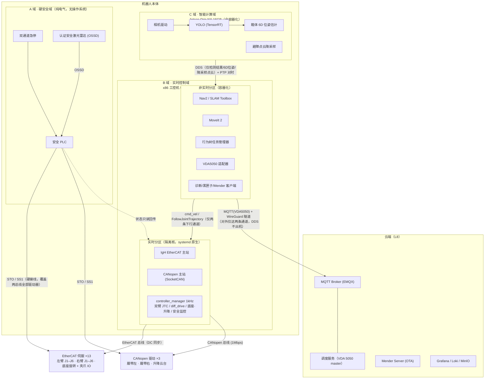

# 移动复合机器人整机软件架构设计

> 视觉识别 · 雷达导航 · 机械臂运控 · 自研电机驱动 —— 面向产品化的 ROS 2 整机架构

## 0. 文档说明

**读者**：刚入行的机器人软件系统架构师。本文档不只给结论，还解释每个分层和选型"为什么"，并标注新手最容易踩的坑。

**需求画像**（两轮需求澄清的结论）：

| 维度 | 结论 |
|---|---|
| 整机形态 | 履带式移动复合机器人 = 履带底盘 + 升降云台 + 360° 可旋转底座 + **双**六轴机械臂，视觉引导抓取箱子（搬运/上下料） |
| 软件框架 | ROS 2 |
| 硬件路线 | 关节/电机驱动**全自研**（自选电机+伺服，需自建总线主站与实时控制环） |
| 电机与总线 | 双臂 2×6 轴 + 底座旋转轴走 **EtherCAT**；履带左右驱动电机 + 升降云台电机走 **CANopen**（硬件路线已定，架构按双总线设计） |
| 视觉任务 | YOLO 检测箱子、3D 抓取位姿估计（6D）、视觉辅助导航/避障 |
| 运控要求 | 点到点 + 轨迹跟随即可，暂不需力控，但留升级空间 |
| 非功能需求 | 人机共处安全、多机调度+云平台、OTA+远程运维（全都要） |
| 计算平台 | 未定型，本文给出选型结论 |
| 项目阶段 | 产品化目标，新手团队 |

**怎么读**：先读第 1~2 章建立整体图景，再按你当前要动手的子系统跳读对应章节。每章末尾的"新手避坑"值得反复看。

---

## 1. 设计总方针

整个架构由三条原则牵引，后文所有决策都能追溯到它们：

1. **自研火力全部集中在实时总线控制层，其余最大化复用生态。**
   全案唯一"重自研区"是电机驱动/实时控制层（因为硬件全自研，没得选）。导航用 Nav2、臂规划用 MoveIt 2、驱动框架用 ros2_control、任务编排用 BehaviorTree.CPP——这些是行业事实标准，新手团队自研任何一块都是进度黑洞。

2. **安全功能硬件化、独立化，绝不经过 Linux/ROS 2/DDS。**（不可妥协项一）
   Linux + ROS 2 是"尽力而为"系统：内核调度抖动、DDS 发现风暴、节点崩溃都可能带来数百毫秒不可预期延迟，无法通过 ISO 13849-1 的性能等级（PL）评估。保命的功能（急停、安全区域停机）必须走纯电气/安全 PLC 回路；软件只做"第二道防线"，保任务、保设备，不保命。

3. **多机调度、云平台、OTA 的接口第一天就留，平台后期再建。**（不可妥协项二）
   设备唯一 ID 与证书、A/B 分区、统一错误码、诊断上报规范、版本 manifest——这些"事后补等于返厂"的东西从第一个版本就要有；调度服务、观测大盘等云端设施可以二期再建。

---

## 2. 总体架构：四域九层

### 2.1 四个部署域

整机划分为四个**部署域**，域边界就是失效隔离边界：



四个域各自的"人设"：

- **A 域（硬安全域）**：纯电气回路，无操作系统。急停/安全雷达触发 → 安全 PLC → 驱动器 STO/SS1。它的动作与任何软件状态无关，软件对它**只读不写**。这是未来 ISO 3691-4 认证的最小可认证边界。
- **B 域（实时控制域）**：x86 工控机，内部再分两个分区。实时分区（隔离 CPU 核、systemd 原生进程、不进容器）跑 EtherCAT 主站和 1kHz 控制环；非实时分区（容器化）跑导航、臂规划、任务编排、云适配和运维组件。
- **C 域（智能计算域）**：Jetson，定位是**"可整机重启的智能传感器"**——聪明但不可信赖，不跑任何控制/任务关键进程，崩溃、OOM、OTA 重启都不影响 B 域运动安全。
- **云端**：只发任务和配置，**永不参与运动闭环**。断网时机器人的安全与在途任务执行完全不受影响（注意：新订单当然还是要靠网络，"断网自治"指的是安全性和当前任务，不要夸大成"业务不依赖网络"）。

### 2.2 九层分层表

| 层 | 名称 | 职责一句话 | 主要组件 | 实时性 |
|---|---|---|---|---|
| L0 | 硬安全层 | 急停/安全区域的最终兜底，纯电气 | 双通道急停、认证安全雷达、安全 PLC、驱动器 STO/SS1 | 硬件毫秒级，与软件无关 |
| L1 | 实时总线与控制层 | 双总线主站（EtherCAT + CANopen）+ CiA 402 + 1kHz 控制环（**唯一重自研区**） | IgH Master、SocketCAN+CANopen 主站、自研 402 驱动库、ros2_control、双臂 JTC/diff_drive/底座·升降控制器 | 硬实时 1kHz（CANopen 域内部分频） |
| L2 | 设备驱动与模型层 | 传感器接入、URDF 单一事实来源、里程计融合、时间同步 | 官方传感器驱动、robot_localization、linuxptp、标定数据包 | 非实时，时间戳纪律严格 |
| L3 | 感知层 | YOLO 检测、6D 位姿、避障点云（跑在 Jetson） | TensorRT、PCL、easy_handeye2、STVL 数据源 | 非实时按需服务 |
| L4 | 定位导航层 | 建图、定位、规划、精停靠（全用 Nav2，零自研） | SLAM Toolbox、AMCL、Nav2(Smac+MPPI)、opennav_docking | 软实时 20~50Hz |
| L5 | 臂规划层 | 点到点/直线轨迹规划、抓取流水线 | MoveIt 2、Pilz、MTC、pick_ik/TRAC-IK | 非实时，秒级规划 |
| L6 | 任务编排层 | 订单→行为树，错误恢复，整机模式状态机 | BehaviorTree.CPP v4、自研任务管理器 | 非实时事件驱动 |
| L7 | 平台服务层 | 诊断、黑匣子、OTA、远程运维、版本 manifest | diagnostics、rosbag2(MCAP)、Mender、WireGuard、Foxglove | 非实时低优先级 |
| L8 | 云端车队层 | 多机调度、设备管理、数据沉淀 | VDA5050 master、EMQX、Mender Server、Grafana | 非实时，可失联 |

**软件基线**：Ubuntu 24.04 + ROS 2 Jazzy（社区支持至 2029；Humble 2027-05 就 EOL，对刚立项的产品生命周期不划算）。个别传感器 SDK 未适配 Jazzy 的单独评估维护 fork；所有自研代码对 Nav2/MoveIt/ros2_control 的依赖收敛进薄适配层，降低未来版本迁移面。

### 2.3 跨域接口刻意收窄

架构防腐的关键是把跨域接口压到最少几条，每条都可枚举、可测试：

- **非实时 → 实时**（下行运动指令按控制器枚举、条条可数）：`cmd_vel` → `diff_drive_controller`（履带）；左/右臂各一条 `FollowJointTrajectory` → 对应 `joint_trajectory_controller`；底座旋转与升降云台的位置指令（定位轴接口）。上行状态通道（`/joint_states`、odom+TF、`/diagnostics`、驱动器故障事件）单独列明——注意 FollowJointTrajectory 是 action，天然有 feedback/result 回流，"单向"指的是运动指令的方向。
- **C 域 → B 域**：检测结果与 6D 位姿（几十字节级）+ **降采样后的**稀疏避障点云（每帧几 KB）。纪律是"**原始数据不跨机**"——原始图像和稠密点云永远留在 Jetson 进程内，而不是"点云一概不跨机"（避障和 MoveIt 碰撞环境确实需要点云，但必须是裁剪/降采样后的低带宽表示）。
- **机器人 → 外部**：仅 MQTT(VDA 5050) 业务通道 + WireGuard 运维隧道两条，DDS 流量绝不出机。

### 2.4 一次典型任务的端到端数据流

"接单 → 导航到货架 → 精停靠 → 识别箱子 → 抓取 → 搬运 → 放置"：

1. 云端调度按 VDA 5050 发布 order（节点/动作序列）→ 机上 `vda5050_adapter` 翻译成任务管理器的任务；
2. L6 行为树先做前置检查（诊断健康树绿、电量够、臂在收拢位），然后下发 `NavigateToPose`；
3. Nav2 全局规划（Smac）+ 局部控制（MPPI）驱动底盘，视觉降采样点云补雷达盲区；到货架前 0.5m 切 `opennav_docking` + AprilTag 精停靠（±1~2cm）；
4. 底盘刹车、抱闸，升降云台调整到作业高度、旋转底座对准货架（两者都是定位轴：到位并确认后才进入下一步），行为树确认 `base_parked` 后才允许臂动作（互锁详见 §10.6）；
5. 行为树调 `DetectBoxes` action → YOLO 出检测框；调 `EstimateGraspPose` → 点云平面拟合出 6D 抓取位姿（臂静止时拍摄，经手眼外参转到臂基座系）；
6. 行为树调 `PickBox` action → L5 内部 MTC 流水线：可达性预检 → Pilz PTP 到预抓取点 → LIN 直线接近 → 闭爪并校验（位置+电流判断是否抓空）→ attach → LIN 提起 → 收拢到搬运位；
7. 行为树确认 `both_arms_stowed`（双臂收拢、底座回正、升降降到运输位）后才允许底盘移动，导航到目标点、放置（对称流程）、上报任务完成；
8. 全程 2Hz 心跳 + 事件触发把状态/错误码经 MQTT 上报云端。

### 2.5 失效行为矩阵（架构验收标准）

每一条都要做成**可重复的故障注入测试**（拔网线、kill -9、断电），这是整机架构的验收物：

| 失效 | 检测方 | 预期行为 |
|---|---|---|
| C 域（视觉）崩溃/断连 | B 域指令超时看门狗 + costmap 数据源超时 | 受控减速停机 → 降级态（禁抓取；导航限速或停车，见 §7.6） |
| B 域崩溃 | EtherCAT 从站看门狗（WDT）超时 | 驱动器自主进入故障反应（断使能/Quick Stop）+ 抱闸 |
| 人员闯入安全区 | A 域硬件（安全雷达 → 安全 PLC） | 硬件直接减速/SS1 停机，与 B/C 软件状态完全无关 |
| 导航/任务层进程卡死 | 技能级超时装饰器 + 诊断心跳 | 该阶段判失败 → 降级子树（臂收拢、底盘停稳、上报） |
| 臂执行轨迹中上层全崩 | —— | **注意：JTC 会把已接受的轨迹执行完**（不存在"200ms 看门狗中断臂"），见 §9.1 的诚实讨论 |
| EtherCAT 链路断裂 | 主站/从站 WDT | 双臂+底座失能抱闸；履带/升降（CANopen 域）不受影响，可受控停车（见 §3.4） |
| CANopen 总线故障 | 主站 heartbeat/节点守护超时 | 履带+升降进入驱动器故障反应（停车/抱闸）；双臂不受影响，收拢待命 |

---

## 3. 计算平台选型

### 3.1 三条路线对比

| 维度 | (a) 单 Jetson 全包 | (b) 单 x86 + 独立 GPU | (c) 双计算单元（**推荐**） |
|---|---|---|---|
| 实时性 | JetPack 5/6 有官方 PREEMPT_RT 内核包，但 GPU 推理与 1kHz 控制环共 SoC 抢内存带宽，抖动难验收，RT 调优社区经验薄弱 | PREEMPT_RT 与 NVIDIA 闭源驱动长期摩擦，内核升级常破坏 dGPU 驱动 | 实时机不装任何 GPU 驱动，PREEMPT_RT 干净可验收 |
| 算力 | 视觉够用，CPU 同时跑 Nav2+MoveIt+控制环偏紧 | 充足 | 分域各自充足 |
| 功耗/振动 | 最低 | dGPU 工控机在移动平台的功耗/振动可靠性吃亏 | 中等，均可无风扇 |
| 故障域 | 全耦合：视觉 OOM 可拖垮控制 | 全耦合：升级视觉栈波及控制栈 | 彻底解耦：C 域崩溃/OTA 重启不影响 B 域 |
| 成本 | BOM 最低 | 中 | 最高（多几千元） |

**结论：路线 (c)。** 多花几千元买到的是"实时可验收 + 视觉可独立迭代 + 失效隔离可测试"，产品化语境下明确划算。域间只走 DDS，未来上量降本若评估合并，软件架构不用改。

### 3.2 B 域：实时控制计算机

- x86 无风扇工控机，**≥8 物理核**（不要买 Atom 级的 4 核机器：isolcpus 隔走 2 核后，剩下的核要跑 Nav2 + MoveIt + 任务层 + DDS，4 核明显不够），16~32GB RAM。
- **双网口，首选 Intel i210**（IgH EtherCAT 主站的 native `ec_igb` 驱动最成熟）。若选 i226 则必须锁定含 native `igc` 驱动的 IgH 版本（1.6+），并把 IgH 版本号写进受控项——i226 走的是 `igc` 驱动，与 i210 的 `igb` 不是一回事，早期 i226 批次还有公开的掉链问题。
- 网口 1 由 IgH **native 驱动**独占跑 EtherCAT（绕过 Linux 网络栈；注意 IgH 的 "generic driver" 恰恰是走网络栈的兼容方案、实时性最差，别搞反）；网口 2 接车载千兆交换机（机内 DDS 网）。
- **一路 CAN 接口跑 CANopen**（履带+升降）：选 PCIe/mini-PCIe CAN 卡（PEAK/Kvaser/EMS 级，SocketCAN 内核驱动）或工控机板载 CAN。**不要用 USB-CAN 适配器跑控制**——USB 调度抖动和断线风险不可控，USB-CAN 仅限调试用。
- OS：Ubuntu 24.04 + PREEMPT_RT。可用 Canonical 官方维护的 `linux-image-realtime`（经 Ubuntu Pro 获取），**但注意 Pro 免费额度只有个人 5 台，量产每台设备都要 Pro for Devices 订阅**——这笔钱要进 BOM 并走商务确认；备选路线是自维护 PREEMPT_RT 内核或 Debian + RT 内核。
- BIOS 关 C-State/超线程/Turbo。验收：**满载**（GPU 推理跑满、EtherCAT 收发中）`cyclictest` 最大延迟 <100µs，作为出厂测试项——空载达标没有意义。

### 3.3 C 域：AI 计算单元

- Jetson Orin NX 16GB + JetPack 6，全容器化，相机 USB3 直插。
- **版本矩阵要第一天写死，这里有个必翻车的坑**：JetPack 6 宿主是 Ubuntu 22.04 底座，而 Jazzy 官方只为 24.04 出二进制包——"容器里直接跑 Jazzy 镜像"不成立（标准 Jazzy 镜像没有 L4T 的 CUDA/TensorRT，L4T 镜像装不上 Jazzy apt 包）。三选一并固化：
  1. Jetson 侧用 Humble（Isaac ROS 在 JetPack 6 官方支持的就是 Humble），接受与 B 域跨发行版——此时**必须**把跨机接口用到的全部 msg 包在两侧锁同版本源码编译，并把"跨机话题回环测试"列为 CI 项（ROS 2 官方不承诺跨发行版互通）；
  2. 在 L4T 镜像内源码编译 Jazzy（CI 构建成本自负）；
  3. 预研"24.04 容器 + nvidia container runtime 挂载宿主 CUDA/TensorRT"路线，验证通过再采用。
- 建议第一版取路线 1（Humble on Jetson + 接口包锁版本），工程风险最低。

### 3.4 总线与网络拓扑

- **EtherCAT 菊花链**（B 域网口 1 引出，共 13 轴）：左臂 J1–J6 → 右臂 J1–J6 → 底座旋转轴 → 夹爪/数字 IO → 安全状态回读从站，全链 DC 分布式时钟同步。**已知代价**：单链任一点断裂（穿过臂关节和旋转底座的运动电缆是疲劳高发段）→ 链上全部从站失联 → 双臂+底座失能抱闸（履带在另一条总线上不受影响，仍可受控停车）。第一版接受此行为，量产前评估左右臂分链（需多口 EtherCAT 卡）或线缆冗余（环形拓扑，注意 IgH 对冗余的支持有限）。
- **旋转底座走线要点**：若底座需要连续 360° 旋转，EtherCAT 与动力电缆必须过滑环——百兆 EtherCAT 过滑环是可靠性风险点。优先评估"限位 ±180° + 线缆余量环"方案；确需连续旋转则选以太网级滑环，并把误码率/丢帧计数纳入台架验收和运行期诊断。
- **CANopen 总线**（CAN 接口引出，共 3 节点）：履带左驱动 + 履带右驱动 + 升降云台电机，1Mbps，PDO 速度/位置指令 + heartbeat 节点守护。3 节点低频控制（履带 50~100Hz 速度环、升降慢速定位）带宽绰绰有余——这个总线划分与"按实时性需求分总线"的工程逻辑正好吻合：需要 1kHz 同步插补的轴（双臂+底座）全在 EtherCAT 上，CANopen 只挂不需要同步插补的轴。
- **机内网**：B 域网口 2 → 车载交换机 → Jetson、网口型雷达、调试口。DDS 统一 `rmw_cyclonedds_cpp`，配置文件锁定网卡、静态 peer、**关多播**（否则调试笔记本一接入就引发发现风暴）。`linuxptp` 做 B↔C 对时（跨机 TF 的生命线，误差要求 <1ms）；对外 `chrony`，硬件要求带电池 RTC（无 RTC 的板子冷启动时间错乱 → TLS 证书"未生效" → 连不上云也拿不到 NTP，经典死锁）。
- **对外**：独立 4G/5G/WiFi 路由器（或挂 B 域非实时分区的无线模组）→ WireGuard/Tailscale 隧道。DDS 严禁出无线口。

---

## 4. L0 安全架构

### 4.1 为什么安全必须硬件化

"急停到停机"必须有可证明的响应时间与故障覆盖率（ISO 13849-1 的 PL 评估），尽力而为的 Linux/ROS 2 栈给不出这种证明。所以安全分两道防线：

- **第一道（A 域，可认证，保人）**：纯电气/安全 PLC 回路；
- **第二道（B 域软件，不可认证，保任务和设备）**：让机器人"体面地停"，减少硬停机触发次数。

### 4.2 第一道防线：硬安全回路

- **急停链路**：双通道急停按钮（车身多点 + 手持盒，双 NC 触点）+ 安全雷达 OSSD → 可编程安全控制器（SICK Flexi Soft / Pilz PNOZmulti 2，比纯继电器贵但区域逻辑可配置）→ 各伺服驱动器 **STO/SS1** 端子 + 主接触器（**两条总线上的全部 16 台驱动器都要接**——STO 是硬接线，与通信总线是 EtherCAT 还是 CANopen 无关）。全链独立布线，不走以太网。选驱动器时"带证书的 STO"是硬性采购条件。
- **安全雷达**：认证型（SICK nanoScan3 / microScan3，Type 3 / PL d）。**注意选型细节**：入门款通常只支持 1 保护场 + 2 警告场；第一版建议就用标准两层结构——警告场（降速）+ 保护场（SS1，超时兜底 STO）——内圈独立 STO 场需要 Pro 变体，收益有限。
- **速度分档场切换的诚实建议**：按速度切换保护场（ISO 3691-4 的经典做法）需要**安全级测速**——普通自研伺服的编码器信号不能直接当安全信号，认证安全编码器/带 SLS 的驱动器是又窄又贵的细分市场，会反噬"自选电机"的自由度。**第一版推荐**：限制整车最高速度，按最高速度的最坏停止距离设计**固定保护场**，完全避开安全测速难题；nanoScan3 系列本身支持编码器输入做速度相关场切换，作为二期升级路径。
- **停止功能与制动设计（决定保护场尺寸，返工代价最高）**：STO 只是切除力矩，**不等于停下来**——底盘切矩后会滑行，臂的重力轴会下坠。必须：① 底盘按 SS1-t 最坏路径（受控减速失败 → 定时 STO → 抱闸吸收动能）实测停止距离，以此定保护场尺寸，抱闸按动态制动能量和紧急制动次数寿命校核；② 臂重力轴与**升降云台**必须配机械抱闸且掉电即抱（升降举着双臂+负载，掉落后果最重）；③ **制动距离实测提前到样机阶段**，不要拖到认证。履带底盘注意：切矩后滑行特性与轮式不同，制动实测要覆盖满载+坡道工况。
- **急停时的负载**：机器人举着箱子被急停，夹爪若随主回路断电箱子会砸落——夹持机构选断电自锁结构，或其供电回路在风险评估中论证豁免于急停切断范围。

### 4.3 机械臂的人机共处：第一版怎么做才立得住

只靠底盘脚踝高度的 2D 安全雷达做臂的"速度与分离监控（SSM）"**不成立**：人站在保护场外弯腰伸手就能够到臂，2D 地面场看不见上半身。第一版最务实的策略：

- **臂只在无人工位动作**：工位用物理隔离/光幕/安全雷达垂直场封住入口；
- **移动中双臂锁定收拢、旋转底座锁定回正、升降降到运输位**（可加位置开关做硬件监测，作为未来认证升级位）——旋转底座会扩大危险半径，保护场与 footprint 按"双臂收拢 + 底座任意朝向"的最大扫掠包络校核；移动中硬性回正则包络更小，推荐；
- 真 SSM（覆盖臂工作空间的认证 3D 感知）成本高，推迟。

### 4.4 复位策略：不要一刀切

- 急停按钮、双通道不一致、传感器故障 → **人工现场复位**（安全审核必查项）；
- **保护场入侵触发的停机 → 允许"场清空 + 可配置延时 + 声光提示"后自动重启**（restart interlock 在安全 PLC 内配置，本身可认证；MiR 等量产 AMR 普遍如此）。否则仓库里每次有人路过都要专人去按复位，车队直接瘫痪。

### 4.5 对接工况的监控案例（AMR 安全设计返工率最高处）

精停靠时机器人必须贴近货架/充电桩，标准保护场必然被固定设施触发。要设计**对接专用场集**（缩小保护场 + 安全域监督的强制低速），切换条件在安全域内闭环，B 域只能"请求"进入对接档、不能强制。同时画整车传感器覆盖图：单台 270° 雷达在倒车/旋转方向有盲区，对接普遍要倒车——加第二台雷达或"限制倒车速度 + 接触式保险杠"兜底。

### 4.6 安全状态回传与合规路线图

- 安全 PLC 状态（急停、当前场集、OSSD、STO 反馈）经**标准现场总线网关模块**（非安全数据，不需要 FSoE 安全从站——只读诊断用普通通道即可，别多花冤枉钱）只读映射进 B 域，发布为 `/safety_state` + diagnostics。**不存在任何从 ROS 写安全 PLC 的通道**；安全 PLC 程序变更走独立受控流程（版本入库、双人复核）。
- **现在就做**（返工代价最高）：ISO 12100 风险评估并存档（它是安全功能选型的设计输入，不是事后文档）；守住"安全链不经软件"边界；元器件选带证书的；建安全需求追踪表（危险源→安全功能→PL→验证方法）。
- **认证阶段再补**：ISO 3691-4 型式试验、EMC、安全 PLC 程序 V&V 文档；臂侧按 ISO 10218-1/-2:2025。
- **不要做**：试图让 ROS 2 节点过安全认证——目前不现实。

---

## 5. L1 电机驱动与实时控制层（唯一重自研区）

### 5.1 双总线拓扑（硬件已定）：EtherCAT（双臂+底座）+ CANopen（履带+升降）

- **EtherCAT 域（13 轴）**：左臂 J1–J6 + 右臂 J1–J6 + 底座旋转。双臂 1kHz 同步插补 + DC 分布式时钟（轴间同步 <1µs）是硬需求，只有 EtherCAT 能满足——CANopen 1Mbps 的带宽和 SYNC 抖动对 12 轴同步插补远远不够。
- **CANopen 域（3 轴）**：履带左右驱动（速度模式，50~100Hz 指令率足够）+ 升降云台（低速定位轴）。这三根轴不需要同步插补，CANopen 完全胜任。
- 这个划分恰好符合"贵的同步能力只花在需要的轴上"的工程逻辑。代价是两套主站/调试工具/故障模式——自研驱动库的架构要把这层差异吸收掉（见 §5.2）。
- **伺服采购硬性条件清单**（两条总线通用，选型阶段就要拍板，事后返工代价极大）：
  CiA 402 profile + 带证书的 STO 端子 + **多圈绝对值编码器**（否则每次上电 13 轴都要回零，自研库还得实现 Homing 模式）+ **驱动器内建抱闸管理（时序参数可配；臂重力轴与升降轴必须掉电即抱）**；EtherCAT 轴另加：支持 CST 力矩模式（力控远期留口）；CANopen 轴另加：支持 heartbeat/节点守护 + 指令超时的可配置故障反应。

### 5.2 主站与自研驱动库

- **EtherCAT 主站选 IgH**（内核态；SOEM 用户态易上手但 DC 同步和实时性要自己啃，仅原型期备选）。**产品化落地风险要正视**：IgH 是 out-of-tree 内核模块，对新内核和 native 网卡驱动的支持常滞后——锁定内核版本，把 IgH 模块纳入 DKMS/镜像构建流水线，**OTA 时内核与 IgH 绑定为同一原子更新单元**；选型阶段先在目标内核上实测 `ec_igb` 补丁可用性。
- **CANopen 主站**：SocketCAN 之上二选一——`ros2_canopen`（ros-industrial 官方包，自带 CiA 402 支持、可直接作 ros2_control 硬件接口，集成最快）或 Lely CANopen 库上自研薄封装（与自研 402 库共用状态机核心，脱栈调试体验一致）。建议先用 `ros2_canopen` 打通，若其实时行为/诊断能力不满足再切自研封装——硬件接口层已隔离，切换不动上层。
- **自研一个"与 ROS 无关"的 C++ 402 驱动库**（`drive402_lib`）：CiA 402 状态机在 EtherCAT(CoE) 和 CANopen(SDO/PDO) 上是**同一套**——把 402 逻辑（状态机含 Fault Reset 路径、模式切换、参数下发、PDO 映射）做成总线无关的核心 + EtherCAT/CANopen 两个传输后端，**附命令行示波/调试工具（两条总线通用）**——售后可脱离 ROS 整栈单独排障，这个库是核心资产，ROS 版本迁移不动它。

### 5.3 PREEMPT_RT 配置要点

- `isolcpus=2,3 nohz_full=2,3 rcu_nocbs=2,3` 隔离 2 核；irqbalance 排除该核。
- 实时环 `SCHED_FIFO` 优先级 80~90（低于 99 的 migration/watchdog）；**用 `chrt` 显式把 EtherCAT 网口 irq 线程优先级调到与实时环配合的位置**（默认 irq 线程是 50），其余 irq 线程迁出隔离核——实时环与网卡中断的相对优先级才是真正关键的问题。
- 启动即 `mlockall(MCL_CURRENT|MCL_FUTURE)` 并预触碰堆栈；实时路径禁止 malloc/阻塞日志/页错误。
- 关深度 C-state（`intel_idle.max_cstate=1`）、BIOS 关超线程。

### 5.4 ros2_control 承载

把自研驱动库封装为 `hardware_interface::SystemInterface` 插件（EtherCAT 可参考 ICube-Robotics/`ethercat_driver_ros2` 的做法，**但只作参考实现，不引入依赖**——引入它就丢掉了"驱动层零 ROS 依赖"的核心卖点）。**一个 controller_manager 挂两个 hardware 组件**（EtherCAT SystemInterface + CANopen SystemInterface），以 1kHz 跑在隔离核（systemd 原生服务，不进容器），CANopen 接口在内部分频写出（如 100Hz）。加载的控制器：

- 左/右臂各一个 `joint_trajectory_controller`（位置接口，接 MoveIt）；
- 底座旋转、升降云台各一个位置控制器（`joint_group_position_controller` 级即可，或带梯形速度规划的简单自研控制器）——它们是任务层调度的**定位轴**，不参与臂的轨迹插补；
- `diff_drive_controller`（履带差速，速度接口，接 Nav2；**cmd_vel 超时直接用它自带的 `cmd_vel_timeout` 参数**，不用自研。注意**履带打滑使里程计可信度远低于轮式底盘**——odom 只作 EKF 的一路弱输入，见 §6/§8）；
- `joint_state_broadcaster`（**必配**——不发 `/joint_states`，MoveIt 和 TF 直接不能工作，新手常漏）；
- 双夹爪控制器（若夹爪挂 EtherCAT：Jazzy 的 `parallel_gripper_action_controller`；若是独立串口/IO 设备则由厂商驱动节点提供同名 action，L6 接口不变）；
- 自研安全监控 chainable controller——职责收敛为：**驱动器故障聚合（两总线）+ Quick Stop 触发 + 一致性校验 +"双臂未收拢/底座未回正/升降未在运输位则钳零 cmd_vel"互锁强制**。软限位/超速用 ros2_control 自带的 joint limits enforcement，别重复造轮子。

全部执行器共用一个 controller_manager / 一个 1kHz 环（CANopen 域在硬件接口内分频即可），不要另起第二个实时环。

### 5.5 为什么控制环绝不能跑在普通 ROS 回调里

普通 ROS 2 executor 回调走 DDS 收包 → 动态内存分配 → 互斥锁 → 非实时调度，任何一步都可能阻塞数毫秒，且回调时序无保证——对 1ms 预算的环是致命的。正确姿势：实时逻辑只在 controller 的 `update()` 里跑；跨线程数据用 `realtime_tools::RealtimeBuffer`（无锁双缓冲）交换；状态经 `RealtimePublisher` 从非实时侧代发。**任何"在 subscriber 回调里直接写电机"的代码在 code review 直接打回。**

### 5.6 看门狗与失效行为（诚实版）

- **底盘**：`cmd_vel_timeout`（内置）→ 断流即停。
- **臂**：FollowJointTrajectory 是一次性交付整条轨迹，执行期间**没有持续指令流**，"200ms 指令超时"对臂通道无物可超时。真实行为是：上层全崩，JTC 也会把已接受的轨迹（可能数秒）执行完。若产品要求"上层死则臂停"，必须显式设计心跳 → hold/abort 机制，并权衡"轨迹中途急停"本身的风险。第一版可接受"执行完当前轨迹再停"，但要写进风险评估。
- **本层崩溃**：EtherCAT 从站 SM 看门狗必须使能；CANopen 侧对应机制是 **heartbeat/节点守护 + 驱动器指令超时**（主站失联时履带/升降驱动器按配置进入故障反应）。两条总线都要逐轴确认故障反应配置（CiA 402 对象 605Eh）+ 抱闸管理时序——"自主抱闸"不是默认白送的行为。

### 5.7 力控升级预留（两条路线，别混为一谈）

- **路线 A（导纳控制，近期可达）**：腕部六维力传感器（FTS）+ ros2_controllers 自带 `admittance_controller` + 驱动器 CSP 模式即可。采购上预留 FTS 安装位与总线接入。
- **路线 B（关节力矩控制，远期）**：驱动器 CST 模式 + **自研** effort 级控制器 + 完整动力学模型（重力/摩擦补偿）——ros2_controllers 没有现成的关节阻抗控制器，这条路线是真正的自研深水区。
- 第一版硬件接口**只实现 position/velocity**，effort 作为"设计预留"写进文档即可——三接口并存会立刻引入 `prepare_command_mode_switch` 的模式切换复杂度，没必要提前背。

---

## 6. L2 设备驱动与机器人模型层

这一层零自研，但纪律最多：

- **URDF/xacro 是单一事实来源**：履带底盘 + 升降柱 + 旋转底座 + 双臂 + 末端 + 全部传感器外参挂一棵树（运动链：`base_link → lift_link → torso_link → {left,right}_arm_base`，升降和底座旋转是链中的活动关节，视觉/规划全靠这棵树对得上号），Nav2 costmap、MoveIt 碰撞、TF、手眼外参全部从这里出。臂段连杆参数用 CAD 导出并实测校核；惯性参数认真填（未来力控要用）。
- 传感器驱动全用官方包：`sick_scan_xd` / `rslidar_sdk`（按雷达选型）、`realsense2_camera` / `OrbbecSDK_ROS2`（相机，见 §7.2 选型）、IMU 驱动。
- 里程计融合：`robot_localization` EKF（履带 odom + IMU → `odom→base_link`，开 `two_d_mode`）。**履带滑移转向的打滑远比轮式严重**——履带 odom 权重调低（尤其角速度分量）、更依赖 IMU，必要时补激光里程计（rf2o 或 slam_toolbox 的 scan matching）。**新手第一大坑：`diff_drive_controller` 的 `enable_odom_tf` 必须设 false**，否则与 EKF 争发同一段 TF，定位莫名漂移抖动。
- 时间同步：`linuxptp`（B↔C 对时 <1ms）+ `chrony`（对外）。跨机时间没对齐的症状是 TF 外插报错、视觉"抓偏几厘米"的幽灵问题，极难排查——第一天就把对时纳入部署清单和诊断监控。
- **标定数据包**（相机内参、手眼外参、关节零位）版本化落盘（git + 整机 manifest），注意标定是 **per-robot** 数据：端上产生 → 云端备份，绑定序列号，**不是**云端统一分发（分发别人的标定会毁掉抓取精度）。

---

## 7. L3 视觉识别子系统

### 7.1 定位：一颗"可整机重启的智能传感器"

不参与任何运动闭环；节点无状态；对外只输出带时间戳的几何结果与降采样点云。**故障隔离要做到管线级**：前视避障管线（相机驱动+滤波+发布，不含深度学习，简单且稳）与抓取推理管线（腕部相机+YOLO+位姿）**分属不同容器/进程**——别把安全相关的避障输入和任务级推理绑在同一个故障域里。

### 7.2 相机选型（有一个必须纠正的经典误区）

- **布局**：腕部 eye-in-hand 深度相机管抓取（随臂逼近、最后一拍在 30~50cm 处，精度自然收敛）；固定前视 1~2 颗管避障（避障视野不能依赖臂姿态）。**双臂场景 v1 建议只给主作业臂装腕部相机**（另一侧的作业面靠旋转底座换位覆盖）；双臂各配一颗留作量产评估项——成本、USB 带宽预算、两条臂的手眼标定维护量都要重算。
- **技术路线要与型号匹配**：无纹理纸箱面需要**主动红外投射**辅助的深度方案。注意 **Intel RealSense D405 是纯被动双目（没有红外投射器）**，面对大面积单色纸箱正是它的弱项（深度成片空洞）——别照着"D405 近距优化"的名声直接采购。腕部建议 Orbbec Gemini 335 这类带主动投射的型号（实测确认最小工作距离覆盖 30~50cm），或保留 D405 但先用真实纸箱在目标光照下验证深度完整性、必要时外加纹理投射器。前视选 D455/Gemini 336L（长基线）。国内量产供货 Orbbec 更稳。
- **产品化硬伤预警**：腕部相机的 USB3 线缆不是为关节反复弯折设计的——指定拖链级高柔线 + 锁紧连接器，走线进机械评审；diagnostics 里加 USB 掉线/重连计数（现场"视觉偶发掉线"多半是线缆疲劳不是软件 bug）；USB3 对 2.4GHz 的 EMI 干扰也要留意。

### 7.3 推理管线：YOLO 检测 + 几何法 6D 位姿

RGB → YOLO（TensorRT FP16）→ **实例分割掩码**裁剪对齐点云（密集码放时相邻箱前脸共面，纯 bbox 视锥必然带入邻箱点导致抓取中心系统性偏移——用 YOLOv8-seg/YOLO11-seg，开销增量可接受）→ PCL RANSAC 平面分割 → 欧式聚类 → 最小包围矩形 + 法向 + 箱体先验尺寸合成 6D 位姿 → **用先验尺寸对结果做一致性校验，超差报"疑似邻箱粘连"** → TF 变换到 base_link。

为什么不用 FoundationPose/DOPE 等学习型 6D 网络：箱子是规则长方体，几何法零训练数据、参数可解释、失败模式直观。规则物体用通用 6D 网络是大炮打蚊子。

**许可注意**：Ultralytics YOLO 是 AGPL——产品化要买商业授权，或评估 Apache 许可的 RT-DETR/YOLOX。

### 7.4 部署与封装

- **模型分发只用 ONNX**；TensorRT engine 与 GPU 架构/TRT 版本强绑定，绝不能当分发工件。**engine 缓存键 =（ONNX SHA256 + TensorRT 版本 + GPU 架构）三元组**，不匹配或反序列化失败即重建；engine 构建放在 OTA 安装阶段完成并验证通过才标记更新成功（Orin 上构建要几分钟，别留给下一次开机的第一单任务）。
- 节点做成 composable node 同进程组装，**基线诚实定为"同进程 CPU 零拷贝 + 推理节点内部 H2D 拷贝"**——官方相机驱动发布的是 CPU 端 Image，GPU buffer 级零拷贝需要 Isaac ROS/NITROS 或自研 type adaptation，作为性能不达标时的升级项而非基线。
- 异步推理：独立 CUDA stream + 专用线程，订阅回调只入队，**新帧覆盖旧帧**（丢帧优于排队），保证延迟有界。

### 7.5 手眼标定与时间一致性

- 工具用 `easy_handeye2`（主选，立项初期先完整跑通一次；moveit_calibration 的 ROS 2 移植维护不活跃，仅备选），ChArUco 板，15~25 组多姿态，结果进标定数据包。验收：视觉引导触碰已知点误差 <5mm。
- **eye-in-hand 的隐性坑——时间一致性**：把腕部相机结果变换到 base_link 需要**图像曝光时刻**的臂关节状态。第一版直接规定"**最后一拍时臂静止**"规避插值误差；接口清单里显式补上 B→C 的 `/joint_states`/TF 输入（含频率与 QoS）。完整时间戳链路三段各有误差预算：相机曝光时戳 → 驱动映射到系统时钟 → PTP 跨机对时。
- **运行期健康监测**：机身固定位置贴一块 ChArUco 参照板，空闲或抓取失败率异常升高时触发自检（腕部相机看板、比对期望位姿），超阈值上报 diagnostics 并锁定抓取任务提示重标定——外参会因碰撞/温漂/松动悄悄失准，表现就是"抓取莫名偏移"。

### 7.6 避障点云对接 Nav2

Jetson 端处理：距离截断（0.3~4m）→ 5cm 体素降采样 → **平面拟合法地面剔除**（固定高度阈值在坡道/门槛处会出错）→ 每帧数百点的稀疏点云上机内网。B 域侧用 STVL（`spatio_temporal_voxel_layer`）作数据源，**只进 local costmap**（进 global 会累积幽灵残影，是 Nav2 社区最高频问题之一）；STVL 的 frustum 清障参数要按真实相机 FOV 配置。

**失效降级必须显式设计**：C 域宕机时 Nav2 会在无告警的情况下退化为纯雷达避障，低矮货叉/桌沿等盲区障碍静默失防。给视觉数据源配 `expected_update_rate`/存活检测，**断流超阈值触发降级（限速或停车，按场景风险定）**，并把"视觉避障流丢失"作为独立失效模式写进 §2.5 矩阵。

### 7.7 对上接口与模型管理

- 任务接口全用 **action**（`DetectBoxes`、`EstimateGraspPose`）——推理耗时百毫秒到秒级，action 才有超时/取消/反馈；srv 同步调用会把行为树卡死。
- **无状态语义要自洽**：`EstimateGraspPose` 的 goal 传**完整的 Detection3D**（含位姿先验）而不是裸 box id——id 跨调用引用与"无状态"矛盾，C 域重启后 id 就没了。状态由 L6 行为树持有。
- 模型作为独立 OTA 工件（ONNX + 前后处理参数 + 类别表 + 版本号 + SHA256 打成 bundle），本地保留上一版秒级回滚。第一版**不做在线影子模式**（Orin NX 上双模型并行推理挤占算力，超纲）——用回传样本做离线新旧对比评测，达标后灰度下发；但**误检样本回传钩子第一天就要留**，这是视觉长期可维护的关键。

---

## 8. L4 雷达导航子系统

### 8.1 传感器配置

- **导航雷达与安全雷达物理分开**：安全雷达（认证型）的 OSSD 进 A 域安全 PLC；导航用独立普通 2D 工业雷达（SICK TiM / Hokuyo UST 级）。
- **2D 为主，不上 3D**：室内结构化环境下 2D 方案的成熟度/成本/调参难度全面占优；盲区由深度相机点云补。3D（如 Livox Mid-360 + FAST-LIO2）留给多层/坡道场景再评估。
- **双雷达合并的诚实工作量提示**：slam_toolbox 和 AMCL 都只消费**单一** LaserScan 话题，把前后两台雷达合成一个虚拟扫描并不平凡（虚拟原点、时基、互遮挡），ROS 2 生态没有产品级现成合并器。**第一版方案：SLAM/定位只用前雷达（270° 多数仓储场景够用），后雷达只进 costmap 避障**（obstacle_layer 原生支持多观测源）——别在集成期才发现 AMCL 只吃一个话题。
- **履带差速（滑移转向）的导航侧影响**：Nav2 仍按差速模型工作（MPPI + `diff_drive_controller`），但原地转向阻力大、地面依赖强、履带 odom 打滑严重——定位主要靠雷达匹配（odom/IMU 融合策略见 §6）；MPPI 的加减速与角速度约束按履带实测标定，不要沿用轮式默认值。

### 8.2 SLAM 与定位

- 建图：`slam_toolbox`（支持 posegraph 序列化、断点续建、人工修图；**不选 cartographer**——Google 已停投，ROS 2 移植靠社区勉强维护。产品化选型第一原则：**上游活着**）。
- 运行期定位：`nav2_amcl`（粒子云本身就是最好的诊断信号，行为保守，不会悄悄改图）。**第一版锁定 AMCL 单方案**——同时维护 slam_toolbox localization 备选开关会让测试矩阵翻倍，把它写进决策记录即可。
- 生产环境**严禁**用建图模式持续改图（定位基准悄悄漂移）；地图版本化，改图走版本发布流程。
- **丢定位恢复要能闭环**（"导航回 AprilTag 点重定位"是逻辑死循环——导航本身依赖定位）：① 开机初始位姿来源明确（持久化上次可信位姿 + 自检，或规定从 home 桩启动）；② 丢定位时就地旋转搜索视野内 AprilTag（**场地按覆盖率布码，不是只在工位贴**），可见即重置 initialpose；③ 搜不到就升级为人工介入/遥操作牵引，写进 L6 异常流程——不要假装软件能自愈。

### 8.3 Nav2 栈组成

全用官方组件（Jazzy）：`bt_navigator`（与 L6 任务树**严格分两级**，L6 只发 NavigateToPose，导航内部恢复自理）、`SmacPlannerHybrid`（全局）、`MPPI`（局部，Jazzy 主推）、`behavior_server`、`smoother_server`、`collision_monitor`（软件减速，**仅舒适层**）。

- costmap 分层：plugins 链 = static → obstacle（雷达）→ STVL（视觉点云，仅 local）→ inflation；**keepout/speed filter 走独立的 `filters` 列表**（不是 plugins 链成员，speed filter 经 `speed_limit` 话题通知 controller_server——这条隐藏数据通路要知道）。
- **Jazzy 新坑**：`diff_drive_controller` 已只接受 **TwistStamped**，而 Nav2 默认发不带戳的 Twist（`enable_stamped_cmd_vel` 默认 false）——全链路（Nav2/collision_monitor/docking/twist_mux/遥操作）**统一 TwistStamped**，写进集成检查清单，否则机器人第一天就是不动的。

### 8.4 cmd_vel 仲裁（必须画清楚，否则集成期打架）

cmd_vel 生产者不止 Nav2 一个：controller_server、behavior_server（spin/backup）、opennav_docking、collision_monitor、遥操作（建图和调试必需）至少五个。规定统一拓扑：

```
各生产者 → twist_mux（优先级：急停恢复 > 遥操作 > docking > Nav2）
        → collision_monitor → 互锁网关（臂未收拢钳零；维护模式下遥操作可绕过）
        → diff_drive_controller
```

这张图是与实时域和 L6 的接口契约。

### 8.5 到站精定位：三级收敛

1. Nav2 送到工位前 ~0.5m（全局精度 ±5cm 级，够不着臂作业要求）；
2. `opennav_docking`（Jazzy 原生并入）+ AprilTag 视觉伺服进位 → ±1~2cm/±1°（选 AprilTag 而非反光板：零许可成本、与视觉栈共用标定设施）；
3. **最后误差不由底盘消化**：到位后臂上相机对箱子重做 6D 位姿，MoveIt 补偿。**底盘只需把目标送进臂工作空间中央**——这条分工把停靠指标从"苛刻"降为"宽松"，是整机层面最划算的设计。

### 8.6 footprint 与风险定性

- footprint 用"双臂收拢 + 底座回正 + 升降运输位"姿态的实际外轮廓多边形（含双夹爪/载箱最大突出量），不用内切圆；空载/持箱两套参数切换。移动中底座建议硬性回正（否则要按任意朝向的旋转扫掠包络算 footprint，白白变大）。
- **诚实的风险定性**：A 域 2D 安全雷达只覆盖踝部平面，**扫描平面外的悬空/低矮障碍（叉车货叉、桌沿）没有安全层覆盖**，只能靠导航层的视觉点云——这不是"舒适层"话术能带过的。对策：给出深度相机 FOV 覆盖图与盲区清单；无后向感知时限制/禁用 backup 行为（缩距离、降速、声光提示）；已知悬空结构用 keepout 圈死；货叉高频场景评估补后向/斜向深度相机。
- **诊断接口是本子系统对外契约的一部分**：AMCL 协方差/粒子离散度告警、各数据源更新率监控、导航失败/恢复计数，经 diagnostic_updater 上报——云端不可能靠人盯每台车的粒子云。

---

## 9. L5 机械臂运动规划

### 9.1 规划/执行分离与诚实的失效语义

规划（move_group，非实时容器）与执行（JTC，1kHz 实时环）分离，之间的下行运动通道是左右臂各一条 FollowJointTrajectory；上行依赖 `/joint_states` 等状态回流（接口清单里要列全）。**诚实的失效语义**（见 §5.6）：轨迹一旦被 JTC 接受，上层崩溃不会自动停臂——执行期监护（谁存活、谁负责 cancel goal）必须显式设计，安全事件（急停恢复、场入侵）与 JTC 的交互（cancel/hold/恢复流程）要有明确定义。

### 9.2 模型、双臂策略与规划器

- Setup Assistant 生成 SRDF：`left_arm`/`right_arm` 两个规划组 + 双夹爪组、各自 `tcp` 系、命名位姿（home/**tuck**/transport）、自碰撞矩阵（**双臂互碰对绝不能剔除**）。碰撞体一律简化几何（盒/圆柱/凸包），可视化 mesh 与碰撞 mesh 分开。
- **底座旋转轴与升降轴不并入臂规划组**：作为任务层先行调度的定位轴（转到位、升到位、确认后臂再动）——把 6 轴问题保持在 6 轴，避开 7/13 自由度冗余规划的复杂度。
- **v1 只做单臂交替作业**：任一时刻只规划/执行一条臂，另一条臂以当前关节状态作为 Planning Scene 里的活动碰撞体（joint_states 实时更新，MoveIt 自动处理）。双臂协同操作（合抱大件、双臂同步轨迹）是运动规划深水区（闭链约束、轨迹同步），列入远期演进，不进第一版。
- **Pilz Industrial Motion Planner（PTP/LIN）为默认**：同输入同轨迹，产线可复现可验收。**OMPL(RRTConnect) 仅作绕障兜底**——把随机规划器当主力上产线，真机每次轨迹不同、无法验收，是新手高频坑。笛卡尔直线用 Pilz LIN 而不是 `computeCartesianPath()`（后者只出路径不出时间律）。
- **时间参数化按管线区分**（别写"所有轨迹统一过 TOTG"）：Pilz 自带梯形时间律（需配 `cartesian_limits.yaml`），TOTG 只作为 OMPL 管线的 request adapter。限幅统一收敛在 `joint_limits.yaml`。
- **IK 选型不能缺席**：自研 6 轴臂没有厂商解析解，MoveIt 默认 KDL 数值 IK 成功率低——`kinematics.yaml` 明确选 `pick_ik` 或 TRAC-IK（构型允许时用 IKFast 生成解析解），把 IK 成功率/耗时纳入验收；Pilz LIN 在奇异位形附近会失败，抓取姿态候选集在预检时剔除近奇异解。

### 9.3 Planning Scene：两类障碍、两种处理 + 一个必踩的坑

- 环境避碰：C 域降采样点云经 `PointCloudOctomapUpdater` 进 OctoMap（分辨率 2~5cm）。点云来源要写死：若来自腕部相机，需配置 self-filtering、且抓取时相机对着箱子环境更新不到——建议底盘/基座加一台固定深度相机专供环境避碰。
- 目标箱子：由任务层按视觉 6D 位姿显式插入已知尺寸的 `CollisionObject`；闭爪后转 `AttachedCollisionObject`。
- **头号经典坑**：插入 CollisionObject **不会**清除 OctoMap 里箱子自身占据的体素——接近段照样撞"障碍"规划失败。必须同步按箱子包围盒（加余量）**清除对应 OctoMap 体素**（或在点云进 updater 前滤除目标区域），并把"接近段通过碰撞检查"列为联调验收项。

### 9.4 抓取流水线与接口

对 L6 暴露 `PickBox`/`PlaceBox` action（goal：6D 位姿+尺寸+参数；result：统一错误码），内部用 MTC 流水线：可达性预检 → PTP 预抓取点（沿抓取轴退避 10~15cm）→ LIN 接近 → 闭爪校验（位置+电流判抓空）→ attach → LIN 提起 → PTP 搬运位。行为树只看阶段和错误码，不碰 MoveIt API。

**进度风险管理**：MTC 文档少、概念多（Stage/Generator/Propagator）、调试门槛高——初版只做 pick/place 两条固定流水线，预留 B 计划（MoveGroupInterface + 简单状态机）作为里程碑降级路径。

### 9.5 执行对接的必调参数

`joint_trajectory_controller` 的各关节 `trajectory`/`goal` 容差和 `constraints.goal_time` **必须显式调**（默认值常报"轨迹被丢弃"）；执行前以最新 `/joint_states` 重设轨迹起点（首点与真实状态不一致会被拒绝或猛跳）；执行错误码（`PATH_TOLERANCE_VIOLATED` 等）原样上抛 L6 映射为统一错误码，不许中间层吞掉。

### 9.6 臂-底盘互锁（三层防御，语义与强制分离）

1. **L6 编排语义**：BT 主干保证"移动前必过 TuckArm、作业前必过 BrakeChassis"；模式状态机 MOVING/MANIPULATING 互斥；
2. **L1 强制执行（关键）**：实时环里的安全监控控制器读双臂关节/底座/升降的实际位置，任一不在"双臂收拢 + 底座回正 + 升降运输位"包络内就钳零 cmd_vel；MANIPULATING 态钳零履带并保持抱闸。**绝不能只靠行为树**——树崩溃/暂停时靠下层兜底；
3. **A 域预留**：未来认证时加臂位置硬件开关进安全 PLC。

互锁信号定义为两个带确认的状态量：`both_arms_stowed`（双臂收拢 + 底座回正 + 升降运输位的合成量）、`base_parked`，作为行为树中移动/作业动作的硬前置条件。

---

## 10. L6 整机任务编排

### 10.1 为什么用行为树而不是状态机

主干"接单→导航→停靠→识别→抓取→运送→放置"用 FSM 只要 7 个状态，但加上每步的重试/降级/任意时刻暂停取消/低电量插断，状态×事件组合爆炸，恢复逻辑散落在每条迁移边上。行为树把"失败怎么办"做成可拼装子树（`RetryNode`/`Fallback`/`ReactiveSequence`），树是 XML 数据不是代码，新任务=新 XML+复用节点库。

**选型**：BehaviorTree.CPP **v4** + `behaviortree_ros2` 的 `RosActionNode` 异步模板。Jazzy 的 Nav2 同为 v4（**注意：Humble 的 Nav2 是 v3.8**，若平台矩阵把你推回 Humble，"整机 v4 + Nav2 内部 v3.8"两套并存、XML 不通用——这也是坚持 Jazzy 的理由之一）。**Groot2 的实时监控是付费 PRO 功能**（免费版限 20 节点，产品级树轻松超），要么预算商业授权（售后诊断值这个钱），要么降级方案：BT.CPP v4 文件日志转 MCAP + Foxglove 离线回放。

### 10.2 两级行为树纪律

整机树只调粗粒度 action（NavigateToPose、DockRobot、DetectBoxes、PickBox…），导航内部的清 costmap、原地旋转等恢复**留给 Nav2 自己的树**——L6 不要越级再清一遍 costmap（重复且互相干扰节奏）。L6 收到导航最终失败后只做业务级决策：换备选停靠点、换策略或降级。

### 10.3 任务管理器与错误码

自研 `task_manager`：订单接入与 SQLite 持久化、整机模式状态机（INIT/IDLE/MOVING/MANIPULATING/**CHARGING**/DEGRADED/E-STOPPED）、BT 执行器（~20Hz tick）。

**统一错误码体系第一天冻结编码规则**（子系统前缀+等级+码），但要认清：Nav2/docking/gripper 的失败原因各有自己的枚举——在各 action client 节点里显式做"上游错误 → 全栈错误码"映射表，云端据码开工单。

### 10.4 错误恢复与看门狗

- 每个主干阶段外包恢复装饰：导航失败 `Retry(3)` → 备选停靠点 → 降级；视觉找不到目标 → 换观察视点重拍 → 微调停靠 → 上报待远程处置；抓取失败（电流判空抓）→ 退回观察位重估重抓 `Retry(2)` → 标记失败转人工。所有耗尽路径汇入同一**降级子树**：双臂收拢 → 底盘停稳 → DEGRADED → 触发黑匣子快照 → 上报。
- **技能级超时看门狗必配**：`RosActionNode` 只有建连超时，goal 被接受后若技能进程挂死，BT 节点会永远 RUNNING、整树卡死——每个技能节点外包 `Timeout` 装饰器（导航分钟级、识别秒级），超时 cancel 并走失败分支；task_manager 同时订阅各技能的诊断存活状态，server 失联直接判该阶段失败。"机器人在客户现场无限静止且不报错"是高频故障模式。
- 自定义 BT 节点必须实现 `halt()/onHalted()`（否则取消任务后 action goal 不会被 cancel，臂/底盘继续动）；不许在 tick 里做同步阻塞调用。

### 10.5 断点续任务：逻辑状态 + 物理状态

SQLite 恢复"订单进行到哪个阶段"只是逻辑状态；重启/急停复位后**先跑"态势评估子树"**：读夹爪位置/电流判定是否持物 → 臂经无碰撞路径回收拢位 → 重新定位并确认停靠状态 → 持物则跳到运送阶段，否则决定重跑或整单转人工。各阶段设计成幂等，只从阶段边界恢复，绝不试图恢复到半条轨迹中间。

**暂停语义按技能分级**：导航类=取消+重发可续；操作类=只允许在阶段边界暂停（执行中收到暂停延迟到本阶段结束生效）——"任意时刻冻结再原地继续"不是行为树白送的能力。

### 10.6 低电量与充电闭环（v1 必备）

低电量条件（ReactiveSequence 前置检查）→ 完成或安全中止当前阶段 → 复用 NavigateToPose+DockRobot 去充电桩 → CHARGING 态 → 订单挂起策略与状态上报写清楚。OTA 窗口（IDLE+充电位）依赖它，调度不派充电单 OTA 就永远等不到窗口。

---

## 11. L7/L8 云平台、多机调度与 OTA

### 11.1 协议边界：VDA 5050，但要用对

对外协议锁定 **VDA 5050 over MQTT**（broker 用 EMQX，起步 Mosquitto 也行），机上跑独立容器 `vda5050_adapter` 做纯翻译。两点诚实修正：

- **多机交通管制要用 VDA 5050 自己的机制**：master 通过 order 的 base/horizon **逐节点放行**做路权管制（只放行到窄通道入口，到达后再放行通道段）——这不是"云端参与运动闭环"（机器人在已放行 base 内仍完全自治，弱网自治正是该标准的设计意图）。区域锁用带 TTL 的租约+心跳续约，**拿不到租约时在通道入口停车等待**，把这条降级行为写进接口文档。`instantActions`（cancelOrder/startPause/initPosition）到行为树的映射也要补全。
- **臂动作是自定义扩展**：VDA 5050 只标准化了导航订单和少量标准动作，抓取/上下料走自定义 actionType，把自定义 action 目录文档化为正式对外契约——对接第三方 WMS 时导航部分零适配，臂动作照样要协商，不要向团队承诺"零适配"。

一期云端极简：EMQX + 极简调度（订单队列+节点放行+最小充电策略）+ Grafana 看板 + 地图包管理（posegraph+栅格图+站点表同版本发布，存 MinIO/S3）。**state 消息携带地图版本/manifest 版本**（VDA 5050 有 mapId 字段），调度下单前校验站点表版本——灰度期多版本共存，向旧地图机器发新站点 ID 会直接翻车。≥两位数车队且路口冲突频繁再评估 Open-RMF，协议边界不变所以推迟无架构代价。

### 11.2 OTA：三层分离 + 整机 manifest + 跨设备编排

- **系统层**：Mender A/B 双分区 rootfs 原子升级（失败自动回滚）。注意开源版没有增量更新（delta 是商业功能），4G/弱网场景先做带宽测算，必要时评估 RAUC（开源支持增量）；Jetson 侧 A/B 集成需按 JetPack 版本做板级 PoC，不是拿来即用。**实时分区的 deb 是镜像构建的中间产物，预装进 rootfs 走整镜像 A/B**，禁止现场独立 deb 更新（不原子、不随回滚）。Mender 客户端跑宿主 systemd（它要改 bootloader 环境变量，容器化是反模式）。
- **应用层**：ROS 2 节点按域打 OCI 镜像 + docker-compose，经 Mender update module 分发，私有 registry。
- **数据层**：按流向分三类——per-site（地图/站点表，云→端）、**per-robot（标定：端上产生→云端备份，绑序列号）**、per-fleet（参数默认值，云→端）。
- **整机 manifest**：一个 JSON 锁定"rootfs 版本 + 各镜像 digest + 地图/标定包版本"的**测试过的组合**。一台机器人=两台 Mender 设备（B+C），Mender 没有多设备原子更新——**自研一个机上 OTA orchestrator（放 B 域）**作为 manifest 的唯一执行者：先全量下载预检，再按序提交（先 C 后 B），任一侧失败联动回滚；bringup 时双方做版本握手，manifest 不匹配进维护模式。这个 orchestrator 是要进排期的自研件。
- 升级窗口由任务管理器裁决：IDLE 且在充电位。灰度：先内部机 → 试点 → 全量。

### 11.3 日志、诊断与远程运维

- **黑匣子**：rosbag2 snapshot（MCAC/MCAP 格式）环形内存录制，只录小话题白名单（/tf、cmd_vel、关节状态、诊断、检测结果），**绝不录原始图像**。注意 snapshot 触发时只落盘**之前**的缓冲——要"事件前后各 30s"就把缓冲设 ≥60s 并**延迟 30s 再触发**。事件（急停/碰撞/任务失败）触发落盘、附 manifest ID、空闲回传。
- 结构化日志：容器 stdout JSON 化 → fluent-bit → Loki；指标用 **Prometheus remote_write 推送 + 本地 WAL 缓冲**（pull 模型对间歇连网的移动设备不友好，断网期缓存重连补传）。
- **远程运维通道必须限权**：foxglove_bridge 以**只读** capabilities 部署（禁 clientPublish/服务调用/参数写）——否则"合法运维通道远程发 cmd_vel"这条路径在安全审核会被打回；写操作走独立的有人员认证+会话审计的流程，且非维护模式下机上直接拒绝远程控制类话题；SSH 全审计。
- 安全：每台产线灌装唯一 X.509 设备证书（序列号即 CN），MQTT/OTA 全 mTLS，EMQX 按证书做 topic 级 ACL；私钥进 TPM。

### 11.4 分期（给新手的诚实清单）

- **第一天就要有**（事后补=返厂/重刷全部设备）：设备唯一 ID+证书灌装流程、A/B 分区（分区表出厂定死）、VDA 5050 adapter 骨架、diagnostics 规范、整机 manifest 习惯、时间同步（chrony+电池 RTC，先对时再做证书类连接）。
- **二期**：调度+节点放行、观测栈、黑匣子自动回传、灰度 OTA。一期若自托管 EMQX/Mender/registry/MinIO/Grafana 会有 7+ 个云端服务的隐性运维成本——能用托管就用托管（Hosted Mender、云对象存储），registry 一期用轻量 registry:2 即可。
- **三期**：Open-RMF 评估、镜像签名（cosign）、安全审计、多租户。

---

## 12. 代码工程结构与研发流程

### 12.1 monorepo + 单 colcon workspace

整机任何一个版本对应一个 git SHA，接口改动和上下游适配在同一原子提交完成，OTA manifest 由 SHA 生成。第三方 fork 用 `vcstool` 的 `external.repos` 锁 commit 引入（**ICube 的 ethercat_driver_ros2 只作参考实现在文档引用，不引入依赖**——引入即丢掉"EtherCAT 层零 ROS 依赖"卖点）。

```
robot_ws/
├── src/
│  ├── robot_interfaces/         # 唯一接口层：全部自定义 msg/srv/action
│  │  ├── robot_common_msgs/     #   错误码、模式状态、诊断扩展
│  │  ├── robot_perception_msgs/ #   检测框、箱体6D位姿
│  │  ├── robot_task_msgs/       #   订单/任务 action
│  │  └── cloud_api/             #   云侧 API schema（protobuf/OpenAPI，同级评审）
│  ├── drivers/
│  │  ├── ecat402_lib/           # 与ROS无关的 IgH+CiA402 库 + CLI示波/调试工具
│  │  ├── robot_hw_interface/    # ros2_control 硬件插件（薄封装）
│  │  └── robot_sensor_drivers/  # 官方传感器驱动的参数化包装
│  ├── control/                  # 控制参数
│  ├── robot_safety_monitor/     # 自研安全监控controller（独立包+CODEOWNERS强制评审）
│  ├── perception/               # YOLO节点、点云位姿估计、手眼标定工具
│  ├── navigation/               # Nav2/SLAM 配置包、精停靠
│  ├── manipulation/             # MoveIt2 配置、MTC抓取流水线
│  ├── orchestration/            # BT 树 + 任务管理器
│  ├── robot_fleet/              # VDA5050 adapter、遥测上传、远程诊断入口
│  ├── robot_recording/          # MCAP 黑匣子、滚动清理
│  ├── bringup/
│  │  ├── robot_description/    # URDF/xacro 单一事实来源
│  │  ├── robot_bringup/        # 分域launch（B域/C域各一入口）
│  │  └── robot_variants/       # 分机型参数 overlay
│  ├── simulation/               # gz世界、gz_ros2_control 配置（依赖方向：simulation→bringup）
│  └── tools/                    # 标定、日志分析、故障注入脚本
├── docker/  ci/  repos/external.repos
```

### 12.2 依赖规则（CI 强制，不靠自觉）

用**显式逐包白名单**（不要链式规则——"perception→control→drivers"会放行"感知依赖控制"这种最该拦的侵蚀）：

- `perception`/`navigation`/`manipulation`/`orchestration` 各自只准依赖 `robot_interfaces`（导航/操作可另加对 controller 接口的声明依赖）；同层互依默认禁止，例外逐条登记；
- `orchestration` 通过 action/topic 与实现包交互，不 link 实现包；
- `ecat402_lib` 的 package.xml 出现任何 rclcpp/ROS 依赖 → CI 直接红；
- `robot_interfaces` 与 `cloud_api` 改动走 CODEOWNERS 强制架构师评审；
- `bringup` 只含 launch/YAML；`simulation` 依赖 `bringup`（复用其通用 launch），生产包零 simulation 依赖；
- 落地：`ci/check_deps.py` 解析 package.xml 对照白名单矩阵。

### 12.3 仿真与 CI/CD

- 仿真：Gazebo Harmonic（gz-sim）+ `ros_gz` + `gz_ros2_control`——仿真仅替换 ros2_control 硬件插件，controller/Nav2/MoveIt/BT 与真机**同一份 launch/YAML**、`use_sim:=true` 切换。收敛预期："仿真通过 ≈ **任务逻辑层**无回归"（感知精度/时序/真实负载在仿真中不等价）。控制器纯逻辑用 `mock_components/GenericSystem` 单测。
- CI 四段（industrial_ci 基座）：① pre-commit（clang-format、ruff、ament_copyright——**clang-tidy 放到构建段**，它依赖 compile_commands.json，pre-commit 阶段跑不了）；② colcon build + test（lint/单测门禁**第一个 PR 就开**，拖到中期一次性开会爆上千条没人修）+ check_deps.py；③ 无头仿真冒烟——**抓取链路用 fake perception 节点**（发布固定检测框/6D 位姿）验证 BT→MoveIt→控制链，感知精度走 M1 的 bag 回放离线评测，感知在环仿真放自托管 GPU runner 的 nightly（PR 门禁上跑 TensorRT/GPU 渲染必然 flaky，团队会开始无视 CI）；④ main 合入构建发布物：B 域镜像、C 域 arm64 镜像（**用原生 arm64 runner 构建含 CUDA 的镜像**，buildx/QEMU 交叉构建 CUDA 镜像极慢极坑）、实时 deb（预装进 rootfs 镜像）、统一 SHA manifest 交 Mender。
- 发版：按里程碑从 main 切 release 分支打 tag；hotfix 在 release 分支修后 cherry-pick 回 main；结合 Mender 设备分组灰度。

### 12.4 分阶段路线图（验收一律以可重复自动化测试为准，演示成功不算数）

**M1 单模块打通（台架期）**
- `ecat402_lib` 驱动单轴：PREEMPT_RT 下 1kHz 环 8h 运行，**以控制环自身统计验收**——周期抖动直方图、IgH DC 同步偏差、EtherCAT 丢帧/工作计数器异常计数（cyclictest 只作环境基线，它测的是调度延迟，不代表控制环实际抖动）；CLI 工具可独立使能/示波。
- 感知在录制 bag 上输出箱体位姿：标准箱数据集位置误差 <1cm / 角度 <2°。
- 导航在 gz 中 A→B：CI 冒烟绿。
- 手眼标定全流程跑通一次（easy_handeye2）。

**M2 整机串联（样机期）**
- 真机跑通"停靠→检测→抓取→搬运"完整行为树：连续 50 次任务成功率 ≥95%。
- 失效矩阵故障注入全部通过（§2.5 每条做成可重复测试）；B↔C PTP 对时误差 <1ms。
- **制动距离实测 → 确定保护场尺寸**（安全设计的样机期硬任务）。

**M3 产品化硬化**
- 72h 长稳无人工干预；Mender A/B 升级+断电回滚演练通过（含 B/C 双设备编排、版本握手故障注入）。
- 每个节点有 diagnostics 且聚合到整机健康页；MCAP 黑匣子能还原任一次失败任务。
- `robot_variants` overlay 机制在 CI 用一个虚构变体（改臂长/轮距）验证可用即可，不绑真实第二机型。

---

## 13. 新手高频坑 Top 16（全文精华浓缩）

1. **在普通 ROS 2 subscriber 回调里写电机指令**——1ms 预算的环必须只在 controller `update()` 里跑，跨线程用 RealtimeBuffer。
2. **装了 PREEMPT_RT 就以为实时了**——不做 isolcpus/绑核/mlockall/关 C-state 照样抖动上百微秒；验收要在满载下测，且用控制环自身统计而非 cyclictest。
3. **IgH 的 generic driver ≠ 独占网卡**——generic 恰恰走网络栈、实时性最差；要用 native 驱动（i210=ec_igb），网卡型号必须有对应内核版本的 native 补丁。
4. **伺服采购漏条件**——两总线通用：CiA402 + 带证书 STO + 多圈绝对值编码器 + 抱闸管理（臂重力轴/升降掉电即抱）；EtherCAT 轴另加 CST；CANopen 轴另加 heartbeat+指令超时故障反应。少一条日后返工。
5. **把 STO 当"停下来"**——STO 只是切矩，底盘会滑行、重力轴会下坠；保护场尺寸由最坏停止距离决定，臂重力轴必须掉电即抱。
6. **用软件（Nav2/collision_monitor）当安全功能**——过不了 PL 评估也保不了人；保命只能靠 A 域认证安全链。
7. **`enable_odom_tf` 不关**——与 EKF 争发 TF，定位漂移抖动找不到原因。
8. **Jazzy 全链路 Twist/TwistStamped 不统一**——机器人第一天就不动。
9. **OctoMap 里的目标箱子体素不清除**——接近段永远"规划失败"；插 CollisionObject 的同时必须清目标区域体素。
10. **OMPL 当默认规划器上产线**——每次轨迹不同、无法验收；确定性规划（Pilz）为主是工业臂基本纪律。
11. **未对时就跨机传感融合**——TF 外插报错、"抓偏几厘米"的幽灵问题；PTP 对时第一天纳入部署与诊断。
12. **TensorRT engine 当分发工件**——engine 绑定 GPU 架构和 TRT 版本；只分发 ONNX，缓存键含三元组。
13. **BT 节点不实现 halt()/无 Timeout 装饰器**——取消不生效、技能挂死整树永远 RUNNING，"现场无限静止不报错"。
14. **原型期不做 A/B 分区和设备证书**——分区表出厂后没法远程改，证书灌装必须进产线流程，事后补=返厂。
15. **msg 定义散落各功能包**——三个月后必然循环依赖；全部 IDL 第一天收进 robot_interfaces，改动强制评审。
16. **USB-CAN 跑控制、EtherCAT 电缆硬过滑环**——USB-CAN 抖动/断线不可控，只配调试，控制必须 PCIe/板载 SocketCAN；旋转底座优先"限位 ±180° + 线缆余量环"，确需连续旋转必须上以太网级滑环并验收误码/丢帧。

---

## 14. 关键决策记录（ADR 摘要）

| # | 决策 | 理由 | 代价/备选 |
|---|---|---|---|
| 1 | ROS 2 Jazzy / Ubuntu 24.04 | 支持至 2029；Humble 2027-05 EOL；Nav2 BT.CPP v4 一致 | Jetson 侧按版本矩阵单独决策（§3.3） |
| 2 | 双计算单元：x86 实时机 + Jetson | 实时域与 GPU 域物理隔离，失效域解耦 | 多几千元 BOM；上量后可评估合并 |
| 3 | 双总线按轴特性划分：EtherCAT（双臂 12 轴+底座，1kHz 同步插补）/ CANopen（履带+升降，低频速度/定位轴） | 硬件路线已定，且与实时性需求正好吻合 | 两套主站/调试工具；402 驱动库做成总线无关核心+双传输后端吸收差异 |
| 4 | IgH 主站 + 自研 ROS-free 驱动库 | 产品化 DC 同步开箱可用；核心资产不随 ROS 迁移 | IgH out-of-tree 模块与内核版本绑定进 OTA |
| 5 | ros2_control 承载全部执行器 | 行业标准框架，力控升级只换 controller | 实时分区 systemd 原生部署，不容器化 |
| 6 | 安全功能全部硬件化（A 域） | 软件栈过不了 PL 评估 | 安全 PLC+认证雷达成本；第一版用固定保护场避开安全测速 |
| 7 | 视觉 6D 用"检测+点云几何拟合" | 规则箱体零训练数据、可解释 | 密集码放需实例分割掩码+尺寸校验 |
| 8 | slam_toolbox + AMCL + Nav2 官方栈零自研 | 上游活着、社区最大 | 精停靠需 AprilTag 补 ±1~2cm |
| 9 | Pilz 为主 OMPL 兜底 + MTC | 确定性轨迹可验收 | MTC 学习曲线，预留降级 B 计划 |
| 10 | BT.CPP v4 + 自研任务管理器 | 恢复逻辑可拼装、Groot2 可视化 | Groot2 实时监控需 PRO 授权（或 btlog 方案） |
| 11 | VDA 5050 协议边界 + base/horizon 路权管制 | 单机第一天就以车队语义说话 | 臂动作自定义 actionType 需文档化契约 |
| 12 | Mender A/B + 容器应用 + 数据包三层 OTA | 可回滚、灰度 | 自研跨设备 orchestrator 进排期 |
| 13 | monorepo + 显式依赖白名单 + CI 守护 | 分层靠机器守护而非自觉 | check_deps.py 等 CI 基建先行投入 |
| 14 | 双臂 v1 单臂交替作业（另一臂作活动碰撞体）；底座旋转/升降作为任务层调度的定位轴，不并入臂规划组 | 避开双臂协同与冗余自由度规划的深水区，保持 6 轴问题 6 轴解 | 双臂协同搬运列远期演进 |

---

*本文档由多智能体架构设计工作流生成：3 份不同侧重（工程落地/安全可靠/产品运维）的独立总体提案经裁决综合为骨架，9 个子系统并行深潜设计，每份设计稿经过独立的对抗性技术审查（共 81 条审查意见），高/中严重度问题的修正已全部吸收进正文。*
