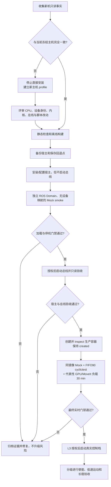
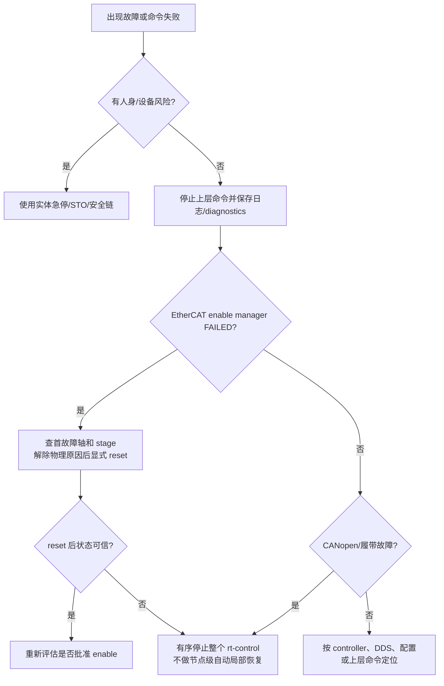

# rt-control 新机部署与运行手册

本文给出从“拿到一台目标机”到“可观察、可停机、可回退”的完整路径，也说明部署后怎样日常使用 rt-control。

先给结论：当前仓库不是任意工控机的一键安装包。`hostsetup` 中的 CPU 拓扑、EtherCAT 网卡、CAN 适配器和验收条件是为现有已批准主机冻结的。新机只有在这些事实完全一致时才能直接使用脚本；任何差异都应先形成新的主机事实清单、修改并评审脚本，再执行安装。

## 0. 安全边界和命令等级

| 等级 | 含义 | 本文中的例子 | 授权要求 |
| --- | --- | --- | --- |
| L0 | 不接触现场总线/执行器的开发或只读检查 | 查看 CPU/网卡、离线构建、Compose 展开、日志 | 可按日常开发流程执行，但仍要管理本机生成物和权限。 |
| L1 | 修改宿主或启动硬件隔离测试进程 | 安装 Docker/IgH、修改 GRUB、启动 Mock/时延测试容器、重启 | 必须确认目标机、影响范围和恢复方式并取得相应授权。 |
| L2 | 访问真实总线但不启动控制应用 | 启动宿主 EtherCAT/CAN、读取拓扑、授权的 SDO upload | 必须取得现场通信授权，设备处于安全状态。 |
| L3 | 启动真实控制栈或改变驱动生命周期 | 生产容器 `up`、reset/enable/disable | CANopen 激活可能初始化并使驱动进入运行状态；必须有隔离区、实体急停/安全链、机械防护/支撑、监护人和单独授权。 |
| L4 | 下发有意运动 | 14 轴 FJT、`/cmd_vel` | 在 L3 条件上，还要逐项批准起点、目标、速度、方向、停止距离和回退方案。 |

必须始终遵守：

- `/rt/disable`、速度置零和软件 diagnostics 都不是急停或 STO。
- 生产容器即使未调用 `/rt/enable`，也会对两条真实 CANopen 履带执行 `init_motor()`、设置 PV 模式并预置零速度，底盘 controller 随即 active；CAN 驱动可能进入 Operation Enabled/激磁状态。因此“启动容器”属于 L3，不是纯通信检查。
- `/rt/enable` 管理双臂、Turn 和 Updown 共 14 个 EtherCAT 轴；两条履带在启动时 active。
- 当前没有独立 `rt_watchdog` 或 motion/autonomy heartbeat，不存在统一的“上层失联后全机自动停机”。`/cmd_vel` 的 0.5 s 普通减速超时不能外推到 FJT 或整机安全。
- 生产 Compose 只能通过 [`tools/rt_control_compose.sh`](../../../tools/rt_control_compose.sh) 调用。
- 包装器的每次调用（包括 `logs` 和 `stop`）都要求先设置同一目标机已经验证的 `RT_CONTROL_CPUSET`。
- Compose 虽挂载 loopback-only CycloneDDS XML，却没有固定 `RMW_IMPLEMENTATION`；当前镜像实际使用 Fast DDS。不能把该文件当作网络隔离，生产启动前必须核对实际 RMW 和 DDS 暴露面。
- 生产 PID 1 只能是已安装的 `rt_control_start`。不得直接启动 launch，也不得用 `ros2 run` 再包一层。
- 正常停机必须给有序失能和总线清理留下时间；不得使用 `docker kill`、`kill -9`、`docker pause`。
- 容器配置为 `restart: unless-stopped`。生产容器一旦启动过，宿主重启后可能自动恢复；进程启动失败或运行中退出时也可能形成反复拉起、重复访问真实总线的循环。维护前要先显式 stop 并核对状态。

## 1. 新机部署决策图



前一级失败，不进入下一级。

## 2. Phase A：收集新机事实（L0）

先记录日期、操作者、目标机资产编号和计划部署的 Git SHA，再执行只读采集：

```bash
hostnamectl
cat /etc/os-release
dpkg --print-architecture
uname -r
cat /sys/kernel/realtime
lscpu -e=CPU,CORE,SOCKET,NODE,ONLINE
cat /proc/cmdline
ip -br link
lspci -nnk
lsusb
systemctl --failed
nvidia-smi
df -h
free -h
```

CPU 隔离不能只看核心编号，还要确认物理 core 和 SMT sibling：

```bash
for cpu_path in /sys/devices/system/cpu/cpu[0-9]*; do
  cpu_name="${cpu_path##*/}"
  printf '%s ' "${cpu_name}"
  cat "${cpu_path}/topology/thread_siblings_list"
done
```

再确认两只 CAN 适配器的稳定 USB serial、EtherCAT NIC 的永久 MAC、驱动和 PCI 地址。不要只记录当次启动得到的 `ethX`、`enpXsY` 或 `ttyACM*` 名称。

对于四个 Ti5，还要冻结每台驱动的 vendor/product/revision/serial 身份、可追溯的固件版本，以及配套 ESI 文件名和哈希。BQ-117 已证明当前 ESI 把 `0x10F1:02` 声明为 32 bit，而实机 upload 长度是 16 bit；历史值 100 的成功不能外推到新批次、新固件或当前新值 250。首次启动须确认没有 startup abort，并以 `uint16` 只读上传逐台确认 250。

### 当前冻结主机只用于对比，不是新机模板

| 项目 | 当前脚本/记录所期待的事实 |
| --- | --- |
| OS/架构 | Ubuntu 22.04 Jammy、amd64 |
| 实时内核 | `5.15.0-1032-realtime`；仓库不负责安装 RT 内核 |
| CPU | i7-14700；CPU 14 为隔离核，CPU 15 是同 core sibling 并下线 |
| EtherCAT NIC | MAC `8c:59:3c:14:ff:d3`，预期环上 16 个位置；位置 15 为 XMC SW 5.11 Updown |
| rt-control CAN | USB serial `004D00675230500720333159`，命名为 `can0` |
| BMS CAN | USB serial `003000265230500720333159`，命名为 `can1`，不归 rt-control 配置 |
| CAN 参数 | `can0` 500 kbit/s，txqueuelen 128，预期节点 2/3 心跳 |
| Docker | Docker CE 29.6.2、containerd 2.2.6，以及脚本冻结的 Buildx/Compose 版本 |
| 其他验收 | NVIDIA、AppArmor、systemd unit、PCIe/Xid 等当前主机特定检查 |

相关事实写在 [`grub-rt.md`](../../../hostsetup/grub-rt.md)、[`verify-host.sh`](../../../hostsetup/verify-host.sh)、[`rt-control-can-names.sh`](../../../hostsetup/rt-control-can-names.sh) 和 [`host-setup-record.md`](host-setup-record.md)。

以下任一项不一致，就不能直接运行现有脚本：

- CPU 型号、core/sibling 关系或计划隔离的 CPU 不同；
- EtherCAT NIC MAC、驱动或 PCI 拓扑不同；
- 任一 CAN 适配器 serial 不同或没有两只适配器；
- RT 内核版本/ABI 不同；
- 现场 EtherCAT 拓扑不是已确认的 16 个位置；
- Ti5 的驱动身份、固件批次或配套 ESI 与已验证记录不一致，或无法追溯；
- GPU、OS 或验证策略不同，导致 `verify-host.sh` 的冻结假设不成立。

此时应把差异改成显式、可审查的新主机 profile，至少联动检查 `grub-rt-apply.sh`、`grub-rt.md`、`verify-host.sh`、`igh-install.sh` 和 `rt-control-can-names.sh`。禁止仅删除检查或改常量来“让脚本通过”。

## 3. Phase B：冻结发布物和回退点（L0）

在仓库根目录记录源码身份并执行静态门禁：

```bash
git status --short --branch
git rev-parse HEAD
tools/quality_gate.sh
```

发布记录至少包含：

- 完整 Git SHA，且目标部署目录是同一 SHA 的干净工作树；
- 镜像引用 `rt-control:<完整 Git SHA>` 和 image ID；
- [`versions.env`](../../../versions.env) 中 IgH 版本/commit；
- [`deps.repos`](../../../deps.repos) 中三个上游完整 commit；
- 目标机事实、目标 `RT_CONTROL_CPUSET`、操作者和时间；
- 当前生产版本及其源码、镜像和宿主配置回退点。

宿主变更前，人工备份并校验至少以下内容。仓库目前没有自动备份脚本：

- `/etc/ethercat.conf`、`/usr/local/etherlab`、IgH 源码/模块；
- `/etc/default/grub` 和 `/etc/default/grub.d`；
- `/etc/NetworkManager/conf.d`；
- 现有 CAN/EtherCAT systemd units；
- `dpkg-query -W`、`apt-mark showhold`；
- 当前内核、模块、网卡、总线和 `systemctl --failed` 状态；
- 当前仓库 SHA、镜像引用、image ID 和 Compose 展开结果。

备份应放在版本化、只读或受控的位置，并实际验证可读。当前主机的历史备份位置只是一条现场记录，不能当作所有新机的默认路径。

## 4. Phase C：构建与传输镜像（L0）

### 4.1 联网构建机

`RT_CONTROL_CPUSET` 必须来自 Phase A 的目标机验证；包装器故意没有默认值：

```bash
export RT_CONTROL_CPUSET=<validated-isolated-cpu-list>
tools/rt_control_compose.sh config
tools/rt_control_compose.sh build rt-control
```

若只有源码拉取层需要临时代理，可在单次构建时设置 `RT_CONTROL_BUILD_PROXY`，构建后立即清除。代理地址、令牌和凭据不得进入仓库、镜像环境或发布日志。

构建后保存证据：

```bash
release_sha="$(git rev-parse HEAD)"
image_ref="rt-control:${release_sha}"
docker image inspect "${image_ref}"
```

核对 image tag 与 Git SHA 一致、IgH OCI label 与 `versions.env` 一致，且镜像 history/env 中没有代理或凭据。

### 4.2 目标机只在应用镜像阶段网络受限

当前仓库没有正式的镜像发布/传输工具。可靠做法是同时交付“干净的同 SHA 源码目录或 Git bundle”和“在联网构建机验证过的同 SHA 镜像”，并在两端比较 image ID。

若现场批准使用文件传输，可采用标准 Docker archive，并额外做 SHA-256 校验：

```bash
docker image save "${image_ref}" | gzip > "rt-control-${release_sha}.tar.gz"
sha256sum "rt-control-${release_sha}.tar.gz" > "rt-control-${release_sha}.tar.gz.sha256"
```

通过现场批准的传输渠道送到目标机后：

```bash
release_sha=<approved-full-git-sha>
image_ref="rt-control:${release_sha}"
sha256sum -c "rt-control-${release_sha}.tar.gz.sha256"
gzip -dc "rt-control-${release_sha}.tar.gz" | docker image load
docker image inspect "${image_ref}" --format '{{.Id}}'
```

目标机上的 image ID 必须与构建机记录相同。不要在网络不稳定的工控机临时冷构建，也不要把某次手工传输描述成已经自动化的发布流程。

这只解决 rt-control 应用镜像和源码的交付，不代表“全离线新机安装”已经成立。后续宿主 bootstrap 仍可能需要：

- 经批准的 PREEMPT_RT kernel、modules 和完全匹配的 headers；仓库没有 RT 内核安装资产；
- Docker 官方 apt key/repository 和冻结版本的 Docker/containerd/Buildx/Compose 包；key 或包未缓存时 `docker-install.sh` 会访问外网；
- IgH 的编译依赖、当前内核 headers，以及 `versions.env` 指定 commit 的完整源码；本机没有该 commit 时 `igh-install.sh` 会从 GitLab fetch；
- CAN/网络/构建所需的 Ubuntu packages。

因此完全离线的新机必须在部署前获得一套经校验、带 SHA-256/签名和来源记录的宿主依赖包，或使用受控联网窗口，并验证现有脚本能消费这些预置资产。当前仓库没有离线 bundle、私有镜像仓库或离线 apt/bootstrap runner；缺少这些条件时应把部署标为 blocked，而不是跳过版本、签名或内核检查。

## 5. Phase D：配置宿主但先不启动总线（L1）

本阶段会修改 GRUB、apt、内核模块、NetworkManager 和 systemd。只有 Phase A 证明目标机与脚本适配并取得明确授权后才能执行。

### 5.1 实时内核与 CPU

仓库没有 RT 内核安装脚本。应先按现场批准的方法安装、选择并启动合适的 PREEMPT_RT 内核，再验证：

```bash
uname -r
cat /sys/kernel/realtime
```

只有当前 CPU 拓扑与冻结配置完全一致时，才能运行：

```bash
sudo hostsetup/grub-rt-apply.sh
sudo reboot
```

重启后检查：

```bash
cat /proc/cmdline
cat /sys/devices/system/cpu/isolated
cat /sys/devices/system/cpu/nohz_full
cat /sys/devices/system/cpu/offline
```

不同 CPU/BIOS 拓扑必须先修改并评审脚本，不能照抄旧机 CPU 14/15。

### 5.2 Docker

当前脚本只支持 Jammy amd64，并安装/hold 精确版本：

```bash
sudo hostsetup/docker-install.sh
```

它不会把普通用户加入 `docker` 组，这是有意的 rootful 安全策略。目标机必须在部署前确定一种经审查的提权方式。不要绕过包装器改用裸 Compose，不要配置 `safe.directory '*'`，也不要为方便把用户加入等同 root 的 Docker 组。

### 5.3 安装 IgH 与 CAN units，但不立即启动

确认 EtherCAT NIC 没有 IP、没有误接办公网络，且设备身份完全匹配后：

```bash
sudo hostsetup/igh-install.sh
sudo hostsetup/can-install.sh
```

不带 `--start` 时不会立即启动总线，但脚本会 enable 相应 systemd units，后续宿主重启可能自动启动。维护窗口结束前必须核对 unit 的 enabled/active 状态。

注意：

- IgH 模块针对当前内核 ABI 编译；内核升级后必须重新构建和完整复测。
- CAN 命名服务要求两只冻结 serial 的适配器同时存在，否则 fail closed。
- 不要安装 `hostsetup/archive/alfa-two` 下的资产；它只属于废弃的旧目标机。

## 6. Phase E：硬件隔离 Mock smoke（L1）

Mock 要使用同一个生产镜像，但必须使用独立 ROS Domain，且不能映射 `/dev/EtherCAT0`。先确认生产容器没有运行。

独立 `ROS_DOMAIN_ID=142` 只避免与生产 Domain 42 混用，不等于网络隔离。由于当前 RMW 未固定，而 T-009 又要求复现 host network 路径，Mock 也可能在现场非 loopback 网卡发送 DDS 流量；只能在已批准的测试网络执行并记录实际 RMW/接口行为。

下面是一份一次性模板；`sudo docker` 应替换为该目标机已批准的 Docker 提权入口：

```bash
release_sha="$(git rev-parse HEAD)"
export RT_CONTROL_CPUSET=<validated-isolated-cpu-list>

sudo docker ps -a --filter name='^/rt-control-mock$'

sudo docker run -d \
  --name rt-control-mock \
  --network host \
  --ipc host \
  --cpuset-cpus "${RT_CONTROL_CPUSET}" \
  --cap-add SYS_NICE \
  --cap-add IPC_LOCK \
  --ulimit rtprio=98:98 \
  --ulimit memlock=-1:-1 \
  --stop-timeout 100 \
  -e ROS_DOMAIN_ID=142 \
  -e CYCLONEDDS_URI=file:///etc/cyclonedds.xml \
  -v "$(pwd)/docker/cyclonedds.xml:/etc/cyclonedds.xml:ro" \
  "rt-control:${release_sha}" \
  /opt/rt_control_ws/install/lib/rt_control_bringup/rt_control_start \
  use_mock_hardware:=true
```

确认没有硬件映射，并观察启动和停止：

```bash
sudo docker inspect rt-control-mock --format '{{json .HostConfig.Devices}}'
sudo docker logs --tail=300 rt-control-mock
sudo docker stop --time 100 rt-control-mock
sudo docker logs --tail=300 rt-control-mock
```

归档证据后再决定是否删除这个停止的容器。Mock 至少验证：

- controller manager 为 250 Hz、FIFO 80；
- joint state broadcaster、Updown、diff-drive、enable manager 为 active；
- `dual_arm_jtc` 为 inactive；
- 停止时 PID 1 会先调用 `/rt/disable` 再关闭 ROS；
- inspect 中没有 EtherCAT device。

GenericSystem 不模拟 CiA402 状态跳转，因此 Mock 中 `/rt/enable` 在第一批返回 `enable_batch_timeout` 是预期结果。Mock 不能证明 PDO/WC/DC、CAN heartbeat/EMCY、方向、抱闸或停止距离。

上面的命令只是一轮早期加载/停机 smoke test，不是完整的新机实时验收。最终 30 分钟门禁要等宿主 EtherCAT/CAN services、设备 IRQ 和生产容器配置均准备完成后执行，见 Phase G；否则只能算空闲主机预备基线。

## 7. Phase F：启动宿主总线并验收（L2）

只有 EtherCAT 环路和两只 CAN 适配器确认无误、设备处于安全状态并获得现场通信授权后：

```bash
sudo hostsetup/igh-install.sh --start
sudo hostsetup/can-install.sh --start
sudo hostsetup/verify-host.sh
```

补充保存以下只读证据：

```bash
sudo ethercat master
sudo ethercat slaves
sudo ethercat slaves -v
ip -details -statistics link show can0
journalctl -b -u ethercat.service
journalctl -b -u rt-control-can-names.service -u can0.service
```

预期至少包括：

- IgH 版本/commit 与容器一致，EtherCAT link UP；
- 16 个环位置全部响应，没有持续 lost frame/WC 增长；
- `can0` 对应批准的 serial、500 kbit/s、txqueuelen 128、ERROR-ACTIVE；
- 能被动观察履带节点 `0x702/0x703` 心跳；
- 没有 failed systemd unit、PCIe Bus Error 或 NVIDIA Xid。

`verify-host.sh` 是当前冻结主机的严格验收，不是通用探测器。若新 profile 合法变化，应同步修改并评审验收逻辑，而不是跳过失败项。

`ethercat slaves -v` 的拓扑一致只是一层检查。生产启动前还应把四个 Ti5 的身份、固件和 ESI 版本与 Phase A 冻结记录逐一比对。任何差异都停在授权的只读归档和厂商/架构评审，不进入生产容器启动；不要现场把 YAML 的 `uint32` 猜改为 `uint16`。若需要 SDO upload 证明对象宽度，它属于 L2 总线请求，必须保存原始回包并单独授权。

[`canopen_sdo_archive.sh`](../../../tools/canopen_sdo_archive.sh) 虽然只做 SDO upload，不写对象字典，但仍会主动向总线发送请求，需要另行取得通信授权。

## 8. Phase G：创建生产容器并完成最终实时门禁（L1/L2）

使用经目标机批准的 Docker 提权方式运行同一个包装器：

```bash
export RT_CONTROL_CPUSET=<validated-isolated-cpu-list>
tools/rt_control_compose.sh config
tools/rt_control_compose.sh create rt-control
tools/rt_control_compose.sh ps -a
```

创建不等于启动。检查展开配置和容器 inspect，确认：

- image tag 等于当前完整 Git SHA，并且目标机已有这个 image ID；
- `Privileged=false`；
- cpuset 只包含经过验证的隔离 CPU；
- host network、host IPC；
- capability 只有 `SYS_NICE`、`IPC_LOCK`；
- rtprio 98、memlock unlimited；
- 只映射 `/dev/EtherCAT0`；
- `cyclonedds.xml` 以只读方式挂载，`CYCLONEDDS_URI` 已设置，但实际 RMW 尚需运行时核对；
- `ROS_DOMAIN_ID=42`。

当前 [`cyclonedds.xml`](../../../docker/cyclonedds.xml) 的内容只绑定 loopback，但 Compose/Dockerfile 没有设置 `RMW_IMPLEMENTATION=rmw_cyclonedds_cpp`。已经检查的当前镜像由 `ros2 doctor --report` 报告为 `rmw_fastrtps_cpp`，因此 `CYCLONEDDS_URI` 很可能未生效；host network 下不能保证远程发现或 DDS 流量被限制在本机。此项是部署缺口，不应靠文档假设解决。生产接入现场网络前必须确认实际 RMW、监听/组播行为和允许的网卡，并把修复作为独立配置变更评审。

这是 Phase H 的硬门禁。应先在已批准、隔离的测试网络中使用同镜像 Mock，通过 `ros2 doctor --report` 和宿主网络观测确认实际 RMW、监听/组播接口和可发现范围，再取得平台/网络安全评审。未测量、未批准，或实际暴露超出允许网卡时，不得启动生产容器；应先修复并验证 RMW/DDS 配置，而不是上线后再观察。

### 8.1 新机最终 T-009 实时验收

此时生产容器保持 `created`、从未启动。宿主 EtherCAT/CAN services、真实设备 IRQ 和已批准的代表性系统负载应处于最终生产形态，然后执行 T-009/BQ-096/BQ-099/BQ-104 的联合门禁：

- 同一生产 image ID、同一已验证 cpuset 的 Mock 控制环连续运行 30 分钟；仍使用 Domain 142、`use_mock_hardware:=true`，不映射 `/dev/EtherCAT0`，不实例化真实 CANopen plugin；
- 另一个一次性诊断容器与它并行运行宿主 `cyclictest`，只读绑定已记录版本的 `/usr/bin/cyclictest`，映射 `/dev/cpu_dma_latency`，使用相同 RT capability/ulimit；
- cyclictest 为单线程 FIFO 90、1 ms interval、`mlockall`，有意给 FIFO 80 的 250 Hz 控制环施压；
- 同时运行该目标机已批准的代表性 GPU/MoveIt 负载。当前冻结主机要求覆盖专有 NVIDIA 模块下的 GPU/MoveIt 联合延迟；新 profile 若没有 GPU，必须有明确裁决和等价的代表性负载，不能静默省略；
- 同时监控 controller/diagnostics、EtherCAT/CAN 接口统计、调度节流、RCU stall、lockup、AER、NVIDIA Xid、内核 warning、温度和资源使用；
- 记录 Mock 的实际 RMW 和 DDS 网络观测，确认结果与已批准的网卡暴露范围一致；
- 任何 cyclictest 延迟 `> 100 us`、controller/容器退出、总线错误增长或上述内核/资源异常，都应立即判失败并停止升级；
- 归档完整命令、生产 image ID、宿主 rt-tests 版本、1,800,000 个周期的完整结果、代表负载身份、Mock controller/diagnostics、总线统计、容器日志和内核日志。

仓库目前没有正式的 T-009 runner，且生产镜像本身不包含 `cyclictest`。不得临场猜测验收命令，也不得把工具装进生产镜像或修改冻结 Compose；应依据上述 BQ 和 [`host-setup-record.md`](host-setup-record.md) 先形成并评审目标机的一次性诊断容器命令。该 30 分钟门禁未通过时，新机部署状态只能记为“准备/调试”，不能记为生产验收通过。

## 9. Phase H：生产控制栈启动与健康检查（L3）

### 9.1 启动

只有实际 RMW/DDS 网卡暴露已经测量并通过平台/网络安全评审，且现场隔离区、实体急停/安全链、机械支撑/防护和监护人全部到位，并单独批准 CANopen 驱动激活后，才能执行：

```bash
export RT_CONTROL_CPUSET=<validated-isolated-cpu-list>
tools/rt_control_compose.sh up -d --no-build rt-control
tools/rt_control_compose.sh ps
tools/rt_control_compose.sh logs --tail=300 rt-control
tools/rt_control_compose.sh logs -f rt-control
```

`up -d` 只表示容器启动请求已提交，不表示 controller 或硬件 ready。使用 `--no-build` 可以避免目标机临时产生一个未记录的新镜像。首次等待 EtherCAT 完整 OP/WC 最长可能接近 70 s，之后还有位置 preload 门禁；不要刚启动就强杀或反复重启。

持续观察 `ps` 和日志。如果容器进入 `restarting`、重复出现相同启动段，或 restart count 增长，应立即用包装器 `stop rt-control` 终止自动重启环，再归档首次失败日志和宿主总线状态。不要让 `restart: unless-stopped` 反复初始化真实 EtherCAT/CANopen。

启动后 enable manager 先进入 `STARTUP_SANITIZING`，不保证直接到 `IDLE`。BQ-115 记录的四个 Ti5 在上次 master release 后通常会以 `0x7500` Fault 出现；应先等待 sanitize 到达稳定的 `FAILED`，确认没有新的物理故障，再按受控流程显式 `/rt/reset_fault`。软件不得自动复位或隐藏该例外。

主接触器急停让执行器掉电、但工控机和旧容器仍在线时，不要反复运行普通一键启动。发布包含该功能的锁定 release
后，应在主接触器恢复且现场条件重新确认时使用：

```bash
cd ~/rt-control-current
./tools/rt_control_ipc.sh recover-power-loss
```

该入口按“旧会话最佳努力 disable → 销毁旧容器并确认 master Idle/Inactive → 人工复电确认 → 新会话 → 一次
reset → 逐轴非激磁状态检查 → 一次 enable”执行。四个 Ti5 的 `0x0021` 例外严格限于 BQ-115 指定轴；其余 10
轴仍要求 `0x0040`。任何失败都不得循环 reset/enable。该流程的首次掉电—复电测试仍属于单独 L3 实机授权。

### 9.2 进入 ROS 运维 shell

`docker exec` 不会继承 PID 1 shell 中的 source，需要手动执行：

```bash
tools/rt_control_compose.sh exec rt-control bash

source /opt/ros/humble/setup.bash
source /opt/rt_control_ws/install/setup.bash
```

先做只读检查：

```bash
printenv RMW_IMPLEMENTATION CYCLONEDDS_URI
ros2 doctor --report
ros2 control list_controllers
ros2 service list
ros2 action list -t
ros2 topic list
ros2 topic echo --once /joint_states
timeout 10 ros2 topic hz /joint_states
ros2 topic echo --once /wheel/odom
timeout 10 ros2 topic hz /wheel/odom
ros2 topic type /tf
ros2 topic type /tf_static
timeout 5 ros2 run tf2_ros tf2_echo base_footprint base_link
timeout 5 ros2 topic echo /diagnostics
```

稳定待机时应看到：

| 对象 | 预期 |
| --- | --- |
| `joint_state_broadcaster` | active |
| `diff_drive_controller` | active |
| `enable_manager` | active |
| `dual_arm_jtc` | inactive；只有 `/rt/enable` 成功后才 active |
| `/joint_states` | 约 50 Hz，14 个 EtherCAT 轴 + 两条履带，共 16 个控制关节名；两条 track joint 不在共享 URDF 中 |
| `/wheel/odom` | 约 50 Hz；`header.frame_id=odom`，`child_frame_id=base_footprint`；无旧 topic 别名 |
| `/tf`、`/tf_static` | 类型均为 `tf2_msgs/msg/TFMessage`；rt-control 单独运行时不存在 `odom → base_footprint`，但保留 `base_footprint → base_link → ...`，树中无 `world` |
| `/diagnostics` | 约 1 Hz，多发布者，按名称聚合 |

至少观察这些诊断节点：

- `/robot/rt_control/enable_manager`；
- `/robot/rt_control/ethercat/master`；
- EtherCAT `slave_1` 到 `slave_12`、`slave_14` 和 XMC `slave_15`；
- CANopen `node_2`、`node_3`。

健康判据包括 EtherCAT `link=1`、`slaves_responding=16`、process data 新鲜、WC error 不持续增长、所需从站为 OP，以及两个 CAN 节点不为 STALE/ERROR。

## 10. 部署后的正常使用

正常作业的高层顺序是：

```text
启动生产通信
→ 等待 startup sanitize 稳定并只读检查 controller、总线和 diagnostics
→ 现场安全条件确认
→ 必要时解除物理原因后 reset_fault
→ 单独批准并 enable 14 个 EtherCAT 轴
→ motion 域发送 14 轴轨迹或底盘速度目标
→ motion 结束/取消 FJT，给履带下发零目标并确认物理静止
→ Updown 随 FJT 到达并保持经批准的安全位置
→ disable 14 个 EtherCAT 轴并确认终态
→ 需要关闭 CANopen 硬件时走 Compose graceful stop
```

### 10.1 14 轴生命周期服务（L3）

三项服务使用同一个空请求和响应结构：

```bash
ros2 service call /rt/reset_fault robot_interfaces/srv/RtEnable "{}"
ros2 service call /rt/enable robot_interfaces/srv/RtEnable "{}"
ros2 service call /rt/disable robot_interfaces/srv/RtEnable "{}"
```

这些命令只能在现场条件满足后按需执行，不应把三条连续复制粘贴。推荐语义是：

1. 只有 diagnostics 显示 `FAILED` 且物理故障原因已解除时才 reset。
2. reset 成功只回到 `IDLE`，不会自动 enable。
3. enable 成功后确认 `ENABLED` 且 JTC active，再允许 motion 发轨迹。
4. 作业结束调用 disable，并确认 JTC inactive、状态回到 `IDLE`。

响应字段为 `ok`、`failed_batch`、`failed_joint`、`status_word` 和 `stage`。常见 `stage`：

| stage | 含义与处理 |
| --- | --- |
| `success`、`already_enabled`、`already_disabled`、`already_clear` | 已达到目标终态或幂等成功。 |
| `operation_in_progress` | 正在执行另一项操作；等待状态稳定，不要请求风暴。 |
| `fault_requires_reset` | 先解除实体故障原因，再显式整组 reset。 |
| `preempted_by_disable` | enable/reset 被更保守的 disable 中断。 |
| `enable_batch_timeout`、`enable_invalid_state` | 已触发回滚；按失败批次、关节和 statusword 查首故障。 |
| `fault_detected`、`unexpected_drive_state` | 已进入整组停止；检查实体安全链和首故障轴。 |
| `jtc_activate_failed`、`jtc_deactivate_failed` | controller 生命周期未达到预期。 |
| `controller_update_timeout` | 客户端等待超时但后台可能仍在推进；先看 diagnostics，不要立即重试。 |
| `restart_required` | 状态已无法确认；完成有序失能并重启整个 rt-control 进程。 |

`/rt/disable` 需要 JTC 切换和多阶段 CiA402 下行，不能替代实体急停。

### 10.2 motion 域的两个执行入口（L4）

生产作业应由 motion 域生成命令，不应让 gateway、autonomy、perception 或人工 CLI 绕过规划直接驱动硬件。

| 功能 | 接口 | 使用前提 | 当前限制 |
| --- | --- | --- | --- |
| 双臂 + Turn + Updown | `/dual_arm_jtc/follow_joint_trajectory`，`control_msgs/action/FollowJointTrajectory` | `/rt/enable` 成功、JTC active、完整 14 轴、第一点与反馈一致 | 手臂、Turn 和新 EtherCAT Updown 尚未完成全部实机验收。 |
| 履带 | `/cmd_vel`，`geometry_msgs/msg/Twist` | CAN node 2/3 健康、方向/比例和停止距离已验收、单一 publisher | 启动即 active，不受 `/rt/enable` 门控；0.5 s 超时和普通减速都不是急停。 |

当前接口参数快照：

- FJT 的完整关节集合和顺序是 `right_joint1`…`right_joint6`、`left_joint1`…`left_joint6`、`turn`、`updown`；不接受 partial goal。13 个旋转轴第一点误差阈值为精确 `0.017453292519943295 rad`，Updown 为 `0.05 m`；EtherCAT 反馈年龄必须不超过 500 ms。
- `/cmd_vel` 当前限制为 `linear.x ±0.3 m/s`、`angular.z ±0.3 rad/s`，线/角加速度为 `±0.6`，jerk limit 未启用。这些 controller 限制不是机械安全距离或急停能力。
- Updown 使用 4 ms CSP，比例为 `6553600 counts/m`，目标范围 `[0.0,0.8] m`，速度上限 `0.3 m/s`，加/减速度上限 `0.5 m/s²`。速度/加速度由 motion 的时间参数化和实机验收保证；当前 JTC 不会自动加载 `joint_limits.yaml` 执行这些上限。

接手开发时可用以下只读命令查看类型和连接关系：

```bash
ros2 action info /dual_arm_jtc/follow_joint_trajectory
ros2 interface show control_msgs/action/FollowJointTrajectory
ros2 topic info /cmd_vel --verbose
ros2 interface show geometry_msgs/msg/Twist
```

不要在普通生产运维手册里放可直接执行的运动数值。受控 commissioning 的 14 轴 FJT 和履带命令必须使用当次实测起点、经 motion 校验的目标、批准的低速参数和现场回退方案。

特别禁止在生产中手工执行 `ros2 control switch_controllers --activate dual_arm_jtc`；它会绕过五批使能联锁。

## 11. 故障恢复

### 11.1 快速判断



CANopen 故障不做节点级自动 NMT 恢复。解除原因后走完整 rt-control 有序停止和重启，避免两个履带节点与 controller 状态不一致。

恢复成功后 diagnostics 可能清除当前失败字段，历史证据主要保留在日志和 commissioning archive。应先归档再恢复。

### 11.2 常见部署/运行故障

| 现象 | 优先检查 |
| --- | --- |
| `RT_CONTROL_CPUSET must be confirmed` | 缺少目标机实测 cpuset；禁止填写仓库默认或照抄旧机 14。 |
| Compose 找不到路径/Dockerfile | 是否绕过包装器；回到仓库根目录使用 `tools/rt_control_compose.sh`。 |
| Docker socket permission denied | 当前用户没有 rootful Docker 权限是预期策略；使用目标机批准的提权入口。 |
| IgH 安装拒绝 | RT 内核/headers、MAC、NIC 是否带 IP、旧模块是否占用。 |
| CAN 命名 unit 失败 | 两只批准 serial 的适配器是否同时存在，是否更换过硬件。 |
| Lely `Operation not permitted` | 宿主 `can0` txqueuelen 是否为 128；不要给容器增加 `NET_ADMIN`。 |
| EtherCAT 启动像卡住 | 完整 OP/WC 门禁最长约 70 s；查 master/slave/WC 日志，不要强杀。 |
| ROS graph 在远程可见或不可见，与 XML 预期不符 | 用 `ros2 doctor --report` 核对实际 RMW；当前 Compose 未固定 CycloneDDS，不能假定 loopback-only XML 生效。 |
| 容器反复 restarting | 立即用包装器 `stop` 终止重启环，保存第一次失败日志，再查 controller/硬件启动原因。 |
| XMC slave 15 无法进入 OP 或 WC 不完整 | 先核对驱动 SW 5.11、`sysPRM.EtherCATEnable=ON`、实机固定 PDO 字节布局和启动 SDO；供应商 XML 的末项与实机不一致，禁止直接覆盖 YAML。 |
| stop 很慢 | Compose 允许 100 s 做失能与总线清理；持续观察日志和最终状态。 |
| 容器 exit 0 但日志有 `UNCLEAN_SHUTDOWN` | 当前退出码不能单独证明失能成功；按不干净停机处理并核查驱动/总线终态。 |

## 12. 正常停机、重启与回退

### 12.1 正常停机

以下是每次部署都要重新满足的验收判据。corrective image
`4fc8414f67b63bf3a1c4fb4c34eb27fe8caafc9d` 已完成三轮 EtherCAT + CANopen
联合有序退出实机验证，但该结果只适用于受支持的 wrapper、当前依赖和当前目标机，不能替代每次发布复验。

```bash
export RT_CONTROL_CPUSET=<validated-isolated-cpu-list>
tools/rt_control_compose.sh stop rt-control
tools/rt_control_compose.sh logs --tail=300 rt-control
tools/rt_control_compose.sh ps -a
```

干净停机不能只看 exit code，应同时确认：

- 日志有 `rt_control shutdown disable result: ok=true`；
- 日志有 `rt_control shutdown controllers quiesced: enable_manager,joint_state_broadcaster`；
- 日志有 `rt_control shutdown EtherCAT hardware state: inactive`，且该行早于 CANopen hardware deactivate；
- 没有 `UNCLEAN_SHUTDOWN`；
- `dual_arm_jtc` 已停用；九个 ZeroErr 与 XMC Updown 到 Switch On Disabled，四个已裁决 Ti5 在 `0x0000` 下可处于 Ready To Switch On；
- EtherCAT master inactive、从站回到 PREOP；
- CANopen 完成安全目标、motor shutdown/NMT Stop 和 driver shutdown。

不能只依赖 controller_manager 的默认硬件遍历顺序：其内部容器不承诺 Xacro 文本顺序。若先清理 CANopen，
全局 read/write 已停止而 EtherCAT deactivate 尚未开始，可能在约 240 ms 清理窗口触发全轴 `0x001B`。
受支持的 wrapper 因此必须先完成上述显式 EtherCAT inactive 确认，再转发 SIGINT 进入 CANopen 清理。

四个 Ti5 的 Ready To Switch On 仅是 BQ-115 基于手册和实测接受的“未激磁”硬件例外，不等于 literal `0x0040`。最终验收必须人工签字；master release 后的 `0x7500` Fault 也意味着下一次启动通常需要显式 reset。不要因为 service success 或容器 exit 0 隐去这两点。

先归档日志，再执行会删除容器的操作。需要重启时，按“stop → 检查收尾 → 再次 up”的顺序，不使用 `docker restart` 代替验收。

### 12.2 应用版本回退

仓库没有自动 rollback。推荐保留独立、干净的旧版本发布目录和同 SHA 镜像，不要在有开发改动的工作树上切换提交。

这里还有一个必须先处理的 Compose 身份风险：wrapper 没有固定 `--project-name`，project name 默认由发布目录的末级名称推导。两个名称不同的发布目录会被 Compose 当作两个 project，可能同时创建 host-network、映射同一 EtherCAT 设备的容器。建议发布布局使用不同父目录但统一末级 `robot`（例如 `<release-root>/<sha>/robot`），并把展开后的 project name 记入发布记录；如果现场要采用其他固定 project-name 机制，必须先修改/评审部署契约，不能临时输入。

回退步骤：

1. 正常停止当前容器并保存证据。
2. 用 `tools/rt_control_compose.sh ls --all` 和 `docker ps -a --filter label=com.docker.compose.service=rt-control` 盘点全部 project/container；任何其他 rt-control 实例必须先确认已停止，不能有 `running` 或 `restarting`。
3. 进入末级目录名与当前 project 约定相同的旧 SHA 干净发布目录，核对 Git SHA、image ID、IgH label 和宿主兼容性。
4. 设置同一台目标机已经验证的 `RT_CONTROL_CPUSET`，用包装器执行 `config`，核对 project name、容器名和所有设备字段。
5. 确认全机只会有这一套 rt-control project，且旧镜像已经存在后，用 `up -d --no-build rt-control` 启动。
6. 重新执行通信、诊断和分级验收；“旧版本”不自动等于“安全版本”。

### 12.3 宿主回退

GRUB、内核、IgH、CAN 和 Docker 回退都属于 L1/L2 维护操作，必须使用 Phase B 保存的精确备份，并做双人复核：

- GRUB 只回退本次新增的精确 drop-in，更新 GRUB 后重启并重新核对 CPU/IRQ。
- 切换内核后，要为新 ABI 重新构建 IgH 模块。
- IgH/CAN 回退要先停生产容器和总线，再恢复对应配置/unit；不得误改 BMS 的 `can1`。
- Docker 包已 hold；升级/降级要在维护窗口显式处理并重跑全套容器验收。

## 13. 上线证据清单与当前未闭环项

每台新机至少归档：

- 目标机只读事实和差异评审；
- 四个 Ti5 的驱动身份、固件版本、ESI 文件/hash，以及 BQ-117 兼容性比对结论；XMC Updown 的 SW 5.11 身份、实机固定 PDO 归档和供应商 XML hash；
- 宿主变更前备份及恢复验证；
- Git SHA、依赖 SHA、image ID、镜像 inspect；
- RT kernel/headers、Docker packages/key、IgH source/build dependencies 等宿主 bootstrap 来源与校验值；
- 质量门禁和 Compose config；
- Mock inspect、controller 状态、日志和有序停止；
- host verification、EtherCAT/CAN 身份与统计；
- 生产启动日志、controller 状态、diagnostics 快照；
- 实际 `RMW_IMPLEMENTATION`、`ros2 doctor --report` 和经评审的 DDS 网卡暴露结果；
- 每一级实机授权、命令、操作者、结果和回退结果；
- 正常停机的日志和总线终态；
- 已知风险、未执行项及原因。

截至本文编写时，不得宣称以下内容已完成：

- T-009 的完整 30 分钟联合空跑/实时负载验证；
- 12 轴手臂、Turn 和 XMC Updown 已完成一次逐轴 `0.5 degree/0.05 m`、单程 `2 s` 的完整 14 轴 FJT
  最小往返；尚未完成多轴同时运动、生产轨迹动态精度、实体方向人工记录和完整实时延迟验收；
- XMC Updown 的故障注入及恢复完整实机验收；启动 SDO、OP、当前位置预装载、第五批使能/失能和首轮最小
  CSP/FJT 已有证据；
- 履带方向/比例、heartbeat/EMCY 及断链后的机械停车验证；
- 更长时间和 fault/EMCY/服务超时条件下的重复 graceful stop 压力证据；当前正常路径已有三轮联合实机证据；
- BQ-115 的四个 Ti5 非 literal 失能终态最终人工签字，以及 master release 后 `0x7500` 的驱动侧反应审查；
- BQ-117 的 Ti5 `0x10F1:02` 数据宽度问题闭环；
- 明确固定并验证生产 RMW/DDS 网卡边界；当前 loopback-only CycloneDDS XML 尚不能证明实际网络隔离；
- 通用新机 profile、全离线宿主 bootstrap、自动镜像发布、readiness/healthcheck 和自动 rollback。

当前证据入口：[`PROGRESS.md`](../PROGRESS.md)、[XMC SW 5.11 固定 PDO 映射](xmc-updown-sw511-fixed-pdo.md)、[XMC 首次整组使能记录](xmc-updown-enable-commissioning-20260727.md)、[CANopen 有序清理与 EtherCAT 同步容忍复测](canopen-shutdown-sync-tolerance-commissioning-20260727.md)、[14 轴 FJT 最小低速运动记录](fjt-14axis-low-speed-commissioning-20260727.md)、[`host-setup-record.md`](host-setup-record.md)、[`ethercat_enable_disable_commissioning.md`](ethercat_enable_disable_commissioning.md) 和 [`canopen_drive_adaptation.md`](canopen_drive_adaptation.md)。代码结构和接口关系见 [接手知识图谱](onboarding-knowledge-map.md)。
