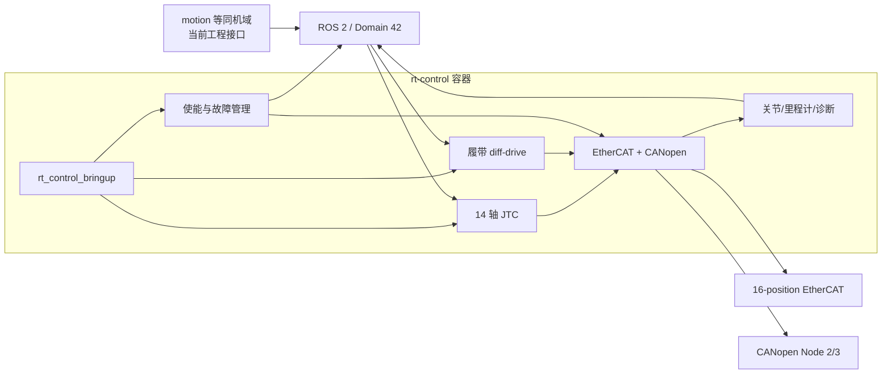

# rt-control Docker 部署与性能验证

> **当前结论：部署成功，可以供同机其他域开展联调。** 这里的“可以联调”表示容器、
> 实时控制、硬件通信、14 轴 FJT 和有序退出已有实机证据；不表示域间接口已经冻结，
> 也不表示整机生产安全验收已经完成。

本文只适用于当前工控机 `ar@192.168.0.40`。新工控机、不同内核或不同硬件拓扑不能
直接照抄本页数值。

## 1. 已部署的交付物

| 项目 | 当前值 |
| --- | --- |
| 实机运行提交 | `4fc8414f67b63bf3a1c4fb4c34eb27fe8caafc9d` |
| 镜像 | `rt-control:4fc8414f67b63bf3a1c4fb4c34eb27fe8caafc9d` |
| 镜像 ID | `sha256:09c8a979c536955d160bc92c60e4531627f13b62a75b00ee108e6ef332226898` |
| 镜像大小 | `550091220 bytes`，约 `524.6 MiB` |
| 不可变运行副本 | `/home/ar/rt-control-releases/4fc8414f67b63bf3a1c4fb4c34eb27fe8caafc9d/robot` |
| 操作系统/内核 | Ubuntu 22.04.5 LTS，`5.15.0-1032-realtime`，PREEMPT_RT |
| EtherCAT 主站 | IgH stable-1.6，commit `2f7f884f1c7d377c02a7d627eb06512126a0e50e` |
| ROS | ROS 2 Humble，`ROS_DOMAIN_ID=42` |

运行副本由已验收源码导出，不含 `.git`。开发仓库仍按 Git HEAD 生成镜像 tag；针对
该不可变导出，一键工具会显式传入上表 SHA，不会把当前文档提交误当成运行镜像。

T-020 已把源码 TF 合同更新为 `odom → base_footprint → base_link`，并通过复用上述镜像依赖的
无设备容器 Mock 验证；上述已验收生产镜像本身尚未包含这次源码变化。新链路需要重新构建、部署和只读复核后，
才能纳入本页的目标机部署结论。

## 2. Docker 内实现了什么

容器已经实现：

- 250 Hz `ros2_control` 实时控制，更新线程为 `SCHED_FIFO/80`；
- 12 个手臂关节、Turn、EtherCAT Updown 共 14 轴完整 FJT/CSP 执行；
- 左右履带 CANopen PV 与 `diff_drive_controller` 速度执行；
- 14 轴分批使能、整组失能、整组故障复位和任一轴故障后的整组处理；
- `/joint_states`、里程计、`/tf`、`/tf_static`、FJT feedback/result 和当前工程版 `/diagnostics`；
- 当前实际位置自动预装载，JTC 第一轨迹点一致性与 EtherCAT 反馈新鲜度检查；
- PID 1 停机包装器：先失能、停控制器和 EtherCAT，再清理 CANopen 与 ROS 进程。

容器启动会访问真实 EtherCAT，并激活 CANopen 履带硬件路径；它不是无硬件的普通
软件容器。14 个 EtherCAT 轴则由 `/rt/enable` 统一使能。

## 3. 重要运行配置

下面是已部署容器的实扫值，不是面向其他机器的推荐默认值。

| 配置 | 当前值 | 作用 |
| --- | --- | --- |
| 网络/IPC | `host` / `host` | 与同机 ROS 2 域通信并访问宿主 SocketCAN |
| CPU | `cpuset=14` | 使用已隔离的独立 P-core |
| 权限 | `CAP_SYS_NICE`、`CAP_IPC_LOCK` | 实时调度和内存锁定 |
| ulimit | `rtprio=98`、`memlock=-1` | 允许实时线程和锁定内存 |
| 设备 | `/dev/EtherCAT0:/dev/EtherCAT0` | 唯一直接映射的硬件设备 |
| 重启策略 | `unless-stopped` | 异常退出后的 Docker 级恢复策略 |
| 停止宽限 | `100 s` | 为失能和总线有序退出留出时间 |
| DDS 配置 | 只读挂载 `/etc/cyclonedds.xml` | 当前文件选择 `lo`，但 RMW 尚未显式冻结 |

控制参数摘要：

| 项目 | 当前值 |
| --- | --- |
| 控制周期 | 250 Hz / 4 ms |
| `/joint_states` | 50 Hz |
| 里程计和 `odom → base_footprint` | 50 Hz |
| RSP 活动本体 TF | 上限 50 Hz，与 `/joint_states` 对齐 |
| 固定本体/传感器 TF | `/tf_static` transient-local；含 `base_footprint → base_link` |
| FJT 关节顺序 | `right_joint1..6,left_joint1..6,turn,updown` |
| FJT partial goal | 禁止 |
| 第一轨迹点误差 | 旋转轴 `1 degree`；Updown `0.05 m` |
| EtherCAT 反馈最大年龄 | `500 ms` |
| 底盘速度 | 线速度 `±0.3 m/s`；角速度 `±0.3 rad/s` |
| 底盘加速度 | 线/角均为 `±0.6`；jerk limit 未启用 |
| 履带无命令超时 | `0.5 s`，按普通减速约束归零 |

Updown 的机械范围为 `[0.0,0.8] m`，比例为 `6553600 counts/m`。配置文件中的
`0.3 m/s`、`0.5 m/s²` 是 motion 轨迹生成和验收上限；当前 JTC 不会自行完成
生产轨迹时间参数化。

## 4. 测试与性能结论

| 验证项 | 结论 |
| --- | --- |
| 镜像构建 | 22 个相关包完成干净构建；IgH、ICube、ros2_canopen 和 JTC 上游版本/补丁均锁定 |
| 配置与 Mock | 14 个 EtherCAT 轴、两条履带、controller 和生命周期接口均能加载；迁移/仓库门禁通过 |
| 实机通信 | 16-position EtherCAT 可到 OP/WC-complete；CANopen Node 2/3 可到 Operational |
| 实机使能 | 14 轴 reset/enable/hold/disable 路径通过；JTC 只在使能成功后 active |
| 最小运动 | 28/28 个完整 14 轴 FJT goal 成功；13 个旋转轴分别往返 `0.5 degree`，Updown 往返 `0.05 m` |
| 有序退出 | 当前镜像先后三轮重复启停及一次运动测试均干净退出；无已修复的 CANopen UAF、SIGSEGV 或 `0x001B` 退出级联 |
| 最终状态 | 容器 `ExitCode=0`，EtherCAT Idle/Inactive、16 个从站全 PREOP；CAN0/1 无 bus-off/error |

运动与保持覆盖的 180 秒性能窗口：

| 指标 | 结果 |
| --- | --- |
| CPU 14 平均/峰值 busy | `4.945% / 23.230%` |
| IgH 所在 CPU 12 平均/峰值 busy | `0.315% / 1.980%` |
| 全机平均/峰值 busy | `0.714% / 1.550%` |
| `ros2_control_node` 平均 CPU | `3.49%` |
| `ros2_control_node` RSS | `591157 KiB`，约 `577.3 MiB` |
| blocked / swap-in / swap-out | `0 / 0 / 0` |

上述结果说明当前硬件上的资源余量足以支撑已测的 250 Hz 逐轴低速 FJT。它没有覆盖
motion/GPU 同时满负载时的 deadline/jitter，因此不能替代后续联合负载验收。

## 5. 已知通信现象

EtherCAT 仍偶发成组短丢包。最近一次 FJT 测试中：

- IgH `Lost frames` 从 399 增加到 402；
- slave 2 port 0 的 `CRC` 从 8 增至 11，`PHY` 从 6 增至 8；
- 三次 `4 datagrams TIMED OUT` 中一次位于 FJT 窗口；
- 没有造成 action 失败、驱动掉使能或控制中断。

现有证据把首要嫌疑定位到 `slave 1 port 1 -> slave 2 port 0` 的线缆、接头或相邻
端口。该风险已获准不阻塞当前低速联调，但仍需维护物理连接并完成 30 分钟
CRC/Lost/WC 零增量复测，不能把“未影响本次控制”写成“通信已经修复”。

## 6. 证据入口

- 14 轴运动：`/var/lib/rt-control/validation/run-18-fjt-low-speed-4fc8414/`；
- CANopen 清理与同步容忍：`/var/lib/rt-control/validation/run-17-bq119-bq122-4fc8414/`；
- 详细原始记录：[14 轴 FJT 最小低速运动](fjt-14axis-low-speed-commissioning-20260727.md)、
  [CANopen 有序清理与 EtherCAT 同步容忍](canopen-shutdown-sync-tolerance-commissioning-20260727.md)。

开发完成度和联调边界见 [rt-control 开发进度与联调准入](integration-readiness-summary.md)；
同事日常启动只需阅读 [rt-control 一键启动](one-command-start.md)。
