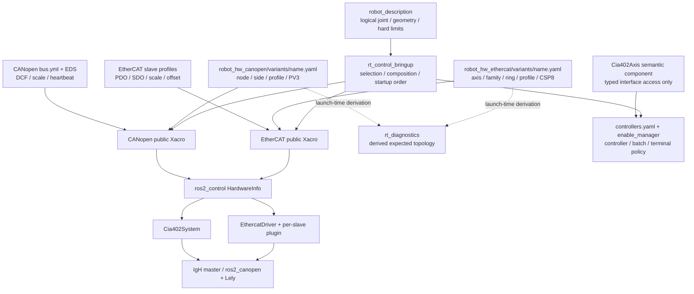

# 硬件配置隔离分层与电机变体维护指南

本文说明 ELECTRI-94 的 Franka 风格硬件分层、owner-local 电机注册表，以及修改电机
型号、数量、地址、传动换算和控制模式时的真实影响范围。当前生产变体只有
`alfa_v1`。

本文不是实机操作授权。修改 PDO/SDO、控制模式、比例、方向或电机数量后，必须按风险
重新执行静态检查、Mock、容器和 HIL/实机门禁；软件状态不能替代急停、STO、驱动器
保护或机械限位。

## 1. 结论

当前实现已经把**具体机型注册**与 **IgH/ros2_canopen 通用驱动实现**隔离：

- EtherCAT 与 CANopen 是两个独立的 ros2_control system plugin，统一 bringup 只负责
  把 `ecat_arms` 和 `canopen_mobile_axes` 组合到一个 `controller_manager`；
- 两个 hardware package 各自持有变体注册表：
  `robot_hw_ethercat/variants/<name>.yaml` 与
  `robot_hw_canopen/variants/<name>.yaml`；
- 变体注册表驱动本总线的 real/mock Xacro，Xacro 通过 ros2_control
  `HardwareInfo` 把轴、地址、profile 和 mode 交给通用 hardware plugin；
- bringup 从同一对已选择的变体注册表派生 `rt_diagnostics` 的预期 topology，仓库中
  不再维护独立的 diagnostics composition 配置；
- `Cia402Axis` semantic component 只封装 loaned interface 的类型化绑定、读写和状态
  解码，不持有电机清单、总线地址、使能批次或生命周期策略；
- `Cia402System` 以私有嵌入方式运行 ros2_canopen；driver/master 的 target、enable、
  mode、TPDO、NMT 与 SDO-write 等可写 ROS 入口不对外创建，命令只能从批准的
  ros2_control/controller 路径进入；
- 未知变体、畸形描述符、重复地址、profile/mode 漂移和当前未认证的 mode 都在启动或
  构建阶段 fail closed。

这里的“电机像插件注册”分成两层：pluginlib 注册可执行的 system/slave 驱动类型，
owner-local variant descriptor 注册某一机器人实例采用哪些轴、地址和已认证 profile。
新增同 ABI 电机变体通常是增加配置注册，不要求把机型名称写入 IgH、
`EthercatDriver` 或 `Cia402System` 的通用 C++。

当前 system plugin 分别是 `ethercat_driver/EthercatDriver` 与
`canopen_ros2_control/Cia402System`；EtherCAT 每轴再通过 `ec_module.plugin` 使用
`ethercat_generic_plugins/EcCiA402Drive`。descriptor 中的 `profile` 是经验证的设备
配置引用，不是可绕过接口与安全准入的动态代码插件。

本方案**不是 strict SSOT**。Robot Model、总线 profile、controller/safety policy 各有
自己的权威 owner；自动测试负责检查它们的契约对齐。以下边界必须如实保留：

- 相同 logical joint/interface ABI 下，把一个轴映射到已经认证的 EtherCAT profile，
  可以只改对应 EtherCAT descriptor 的一行映射；
- 新 profile 至少需要新增/修改 profile，再在 descriptor 中注册；
- 增加或删除 logical joint 仍需 Robot Model、descriptor、controller 和 safety owner
  联动，不能只改一个文件；
- 当前 EtherCAT 只准入 CSP mode 8，CANopen 只准入 Profiled Velocity mode 3；
  CSV/CST 不能通过只改 mode 数字获得支持；
- CANopen 的真实运行接口与 DCF 仍由 `Cia402System` 和 `bus.yml` 共同提供，descriptor
  中的 node/mode 必须与 `bus.yml` 完全对齐。

## 2. 分层和依赖方向



依赖只允许向下。硬件功能包不得依赖 bringup；通用总线驱动不得读取
`controllers.yaml` 或诊断策略；bringup 不再复制 raw motor topology。descriptor 只
派生机械注册和诊断预期，不自动生成使能批次、终态策略、controller tolerance 或其他
安全判断。

## 3. 各层所有权

| Owner | 权威内容 | 明确不拥有 |
| --- | --- | --- |
| `robot_description` | logical joint 名称/类型、轴向、几何、惯量、碰撞和物理硬限位 | PDO/SDO、驱动插件、mode、controller 参数 |
| `robot_hw_ethercat/variants/*.yaml` | system、extra responders、轴的 joint/family/ring/profile/mode 注册；同一轴表派生 ros2_control joint 与 slave sensor | profile 内部 PDO/SDO、JTC joints、使能批次 |
| EtherCAT `config/families.yaml` | 设备族身份引用、公开 ros2_control interface 契约及该族已认证 mode | 具体机型轴表、每台驱动的比例/offset |
| EtherCAT `config/slaves/*.yaml` | vendor/product、PDO/SDO、单位换算、方向、offset 和设备局部事实 | 机型总装、controller 和安全编排 |
| `robot_hw_canopen/variants/*.yaml` | system、joint/node/mode/side/profile 注册 | EDS 内容、heartbeat、比例和 DCF |
| CANopen `config/bus.yml` 与 `config/eds/` | 真实运行 node 配置、EDS/DCF、heartbeat、比例、offset 和生成输入 | Robot Model、diff-drive policy |
| hardware plugins | 解析和严格校验 `HardwareInfo`，执行总线生命周期和失败收尾；CANopen 嵌入路径关闭旁路写 API | `alfa_v1` 名称、固定 joint/ring/node 清单 |
| `rt_control_semantic_components` | `control_word`/`status_word` 类型化绑定与 CiA402 状态解码 | topology、mode、批次、时序和总线生命周期 |
| `controllers.yaml` / `enable_manager` | controller joint/interface、managed joints、使能批次、时序和 Ti5 终态策略 | PDO、EDS、环位和 Node ID |
| `rt_control_bringup` | 变体选择、双 system 总装、启动/停机顺序；从所选 descriptor 派生诊断参数 | 第二份 hardware topology 或隐式 safety 默认值 |
| `rt_diagnostics` | 消费派生 topology，归一化详细状态并发布稳定总线摘要 | 硬件 plugin 配置和电机安全决策 |

`enable_manager` 的 managed joints、批次和终态 policy 必须由 owner 显式配置；缺失时应
拒绝 configure，不能回退到某一机型的隐式轴表。

## 4. 启动时如何使用配置

1. launch 参数 `ethercat_variant` 和 `canopen_variant` 选择两个已安装的 descriptor；
   当前默认均为 `alfa_v1`。
2. bringup 的 `OpaqueFunction` 在创建任何 ROS Node 前校验 variant 标识，加载两个
   hardware package 的 `variants/<name>.yaml`，并只解析稳定的公共 topology 视图；它
   拒绝重复 key、公共字段缺失、非法范围、重复地址和跨总线重名。family、profile、mode
   等硬件私有字段的完整 schema 由各 `robot_hw_*` 包自己的 validator 与 Xacro 严格校验，
   避免 bringup 复制并依赖总线私有 schema。
3. bringup 从 EtherCAT `axes + extra_responders` 计算 responder 数量，并从两份
   descriptor 提取 joint/ring/node 列表，只作为 `rt_diagnostics` 的只读参数。
4. 总装 Xacro 分别把两个 selected variant 名传给对应 hardware package。每个包自己的
   公开宏加载自己的 descriptor，生成 real/mock ros2_control system。
5. 真实分支把 descriptor 值编码为 `HardwareInfo`：EtherCAT 每轴提供
   `ec_module.*`，CANopen 每 node 提供 `node_id` 和 `operation_mode`。通用 plugin 只
   消费这些类型化参数，不识别 `alfa_v1`。
6. EtherCAT 构建门禁检查 descriptor mode、profile SDO `0x6060` 和 RPDO `0x6060`
   默认值一致；CANopen 构建和 Xacro 门禁要求 descriptor node/mode 与 `bus.yml`
   完全一致。
7. CANopen system 在内部加载 master/driver 时强制 restricted embedded 模式：直接完成
   内部 master attach，只保留诊断、状态与 SDO-read，且不创建任何可绕过 controller
   的写入 service/topic。运行时实际 mode 一旦偏离配置 mode，会写零速度、请求全节点
   NMT Stop、锁存失败并要求进程重启；这仍不替代 BQ-027 的机械停车实机证明。

因此，诊断 topology 与硬件选择来自同一对 descriptor，但 controller/safety 与
Robot Model 仍按各自 owner 管理。这是“owner-local registry + alignment tests”，不是
把所有机器人事实塞进一份总配置。

## 5. 当前 `alfa_v1` 配置地图

| 要修改的事实 | Owner 文件 |
| --- | --- |
| EtherCAT 轴、环位、family、profile 与 mode 注册 | `src/rt_control/robot_hw_ethercat/variants/alfa_v1.yaml` |
| EtherCAT family 身份、公开接口与认证 mode registry | `src/rt_control/robot_hw_ethercat/config/families.yaml` |
| EtherCAT real/mock schema 与 `HardwareInfo` 映射规则 | `src/rt_control/robot_hw_ethercat/urdf/ecat.ros2_control.xacro` |
| EtherCAT PDO/SDO、比例、方向和 offset | `src/rt_control/robot_hw_ethercat/config/slaves/*.yaml` |
| CANopen joint、Node、side、profile 与 activation mode 注册 | `src/rt_control/robot_hw_canopen/variants/alfa_v1.yaml` |
| CANopen real/mock schema 与 `HardwareInfo` 映射规则 | `src/rt_control/robot_hw_canopen/urdf/canopen.ros2_control.xacro` |
| CANopen EDS、heartbeat、比例和 DCF 输入 | `src/rt_control/robot_hw_canopen/config/bus.yml`、`config/eds/` |
| JTC/JSB/diff-drive joint、interface 和 enable policy | `src/rt_control/rt_control_bringup/config/controllers.yaml` |
| 诊断预期 topology | 无独立配置；bringup 从上述两份 selected descriptor 派生 |
| logical joint 名称、类型和模型 | 独立 `robot_description` 权威仓库；本仓库是固定构建副本 |

## 6. 按变更类型操作

### 6.1 选择一个已存在并完成认证的变体

只设置 launch 参数：

```text
ethercat_variant:=<variant_name> canopen_variant:=<variant_name>
```

不需要编辑文件。未知名称或 descriptor 不合法会在 Node 启动前失败。新增 descriptor
文件不等于完成认证；仍需经过第 7 节门禁。

### 6.2 相同 logical ABI，映射到已认证 EtherCAT profile

只有同时满足以下条件，才可把运行配置改动局部化到 descriptor 的一个轴条目：

- logical joint 名称、类型和 ros2_control command/state interface 不变；
- responder 数量与环位不变；
- 目标 profile 已存在，并已有该设备身份、PDO/SDO、换算、方向和 commissioning 证据；
- mode 保持当前已认证的 CSP 8；
- controller 和 safety 语义不变。

此时修改
`robot_hw_ethercat/variants/<variant>.yaml` 中该轴的 `profile` 映射即可；通用 C++、
诊断 topology 和 bringup 不需要同步维护轴表。仍必须运行 profile/mode alignment、Mock
和相应 HIL，不得把“只改一个文件”理解为“无需验证”。

### 6.3 新电机 profile，或修改比例/方向/offset

EtherCAT：

1. 根据厂商资料、图纸或实测证据新增/修改 `config/slaves/<profile>.yaml`；共享 profile
   会影响全部引用轴，影响不同时应新建专用 profile。
2. 若引入新的设备族或新的公开 interface/mode bundle，在 `config/families.yaml` 注册其
   canonical identity profile、接口契约和已认证 mode；已有 family 不重复登记。
3. 在 variant descriptor 的目标轴注册该 family/profile。
4. 确认 family identity、接口 PDO binding、descriptor mode、profile SDO `0x6060` 和
   RPDO mode default 完全一致。
5. 逐轴验证身份、方向、零位、比例、PDO、故障和停机。

CANopen：

1. 比例、offset、heartbeat 和实际 node 运行配置仍在 `bus.yml`；EDS 事实在
   `config/eds/`。
2. descriptor 的 joint/node/mode/profile 必须与 `bus.yml` 对齐；修改 Node ID 至少要
   同时修改 descriptor 和 `bus.yml`。
3. 新 profile 还需新增/审查 EDS、DCF 生成路径和 validator 准入，当前不能只在
   descriptor 中把 `ld2_drive` 改成别的字符串。
4. 生成的 `.dcf/.bin` 只能由构建流程重建，禁止手改。

若换算变化还改变物理关节限制、零位或 Robot Model 语义，必须由 Robot Model/标定
owner 同批更新。当前 diff-drive 使用线性 SI 接口，`wheel_radius: 1.0` 是既有接口
约定；不得把真实链轮半径直接填入该字段造成二次换算。

### 6.4 增加或删除 EtherCAT logical motor

至少需要：

1. Robot Model owner 增删 logical joint，并通知所有模型消费者；
2. EtherCAT descriptor 增删 axis，登记 family、ring、profile 和 CSP 8；必要时增加
   新 profile；
3. `controllers.yaml` 同步 JSB/JTC joint、逐轴 tolerance、enable managed joints、批次
   和终态策略；这些 safety 判断不得从 descriptor 自动推断；
4. 检查完整 0-based EtherCAT ring，包括 `extra_responders`；
5. 扩大到 Robot Model、hardware、controller、diagnostics、恢复和停机契约测试。

诊断 joint/ring/responders 会从 descriptor 派生，不再单独改 diagnostics topology
文件；这只消除重复机械清单，不消除 Robot Model 和安全 owner 的联动。

### 6.5 增加或删除 CANopen motor

至少需要：

1. 若该 CANopen joint 属于 Robot Model 的运动学/几何拓扑，由 Robot Model owner 同批
   增删并通知消费者；当前左右履带 joint 是模型外的 ros2_control 资源，不应为配置
   分层而强行写入 Robot Model；
2. CANopen descriptor 增删 node，并登记唯一的 `1..127` Node ID、side、profile 和
   当前 mode 3；
3. `bus.yml` 同步相同 node 名、ID、mode、EDS、heartbeat、比例和 offset；
4. diff-drive 或其他 controller 同步 joint/side/interface，评审 enable/deactivate 与
   group-stop policy；
5. 重新生成 DCF/bin，并验证 activation 部分失败、rollback、EMCY、断链和停机。

诊断 node 列表与生成 `.bin` 文件名可从已校验 descriptor 派生，但 CAN 运行配置仍
必须与 `bus.yml` 对齐。BQ-027/BQ-132 的现场安全与通信阻塞不会因配置分层而解除。

### 6.6 EtherCAT CSP、CSV、CST

CiA402 mode 数字为 CSP=8、CSV=9、CST=10。当前 EtherCAT variant validator 和 Xacro
**只准入 CSP 8**；14 轴公开 `position` command，slave profiles、JTC claim 和
Operation Enabled 前 target-position 预置都按 CSP 设计。

首次支持 CSV 或 CST 必须形成新的已认证 mode bundle，至少包括：

1. 厂商手册、ESI/对象字典与实机证据；
2. mode 对应 PDO/SDO、单位、比例和 profile；
3. `velocity` 或 `effort` command/state interface ABI；
4. 相应 controller 与上层命令契约；
5. CSV 零速度或 CST 零力矩的预置、接管、失能和故障回滚；
6. Mock、补丁测试、断动力通信、HIL 和最终实机验收。

只把 descriptor 的 `mode_of_operation` 从 8 改成 9/10 会立即 fail closed；放宽检查而
不补齐上述 bundle 也不是有效实现。只有某个 mode bundle 完成认证后，后续相同 ABI
变体才可能通过 descriptor selector 使用它。

CANopen 当前不是 CSP/CSV/CST seam。履带只准入 Profiled Velocity mode 3，
`Cia402System`、descriptor validator 和 `bus.yml` 都会拒绝其他 mode。新增 CANopen
mode 同样需要新的 interface/controller/安全生命周期设计，不能复用 EtherCAT mode
数字直接切换。

## 7. 能否只改一个文件

| 变更 | 当前结论 | 最小配置范围 |
| --- | --- | --- |
| 选择已存在且已认证的 variant | 不改文件 | launch selector |
| 同 ABI 轴映射到已认证 EtherCAT profile | 有条件可以 | 一份 EtherCAT descriptor 的目标轴条目 |
| 新 EtherCAT profile | 不可以 | profile + descriptor；必要时模型/安全 owner |
| 修改已隔离 EtherCAT profile 的已裁决换算 | 有条件可以 | 一份 profile；仍需检查引用范围和模型语义 |
| 修改 CANopen Node ID | 不可以 | descriptor + `bus.yml` |
| 修改 CANopen 比例/offset | 有条件可以 | `bus.yml`；影响模型或新 profile 时扩大范围 |
| 增加/删除 logical motor | 不可以 | descriptor + controller/safety；若属于模型拓扑还需 Robot Model，CAN 还需 `bus.yml` |
| EtherCAT CSP/CSV/CST 切换 | 不可以 | 新 profile/interface/controller/safety mode bundle |
| CANopen mode 切换 | 不可以 | 当前仅准入 Profiled Velocity 3 |

目标是减少配置重复和上层冲击，不是用自动生成掩盖安全决策。可机械派生的 joint/ring/
node/diagnostics 列表从 descriptor 派生；controller tolerance、使能批次、终态策略、
比例、方向、对象字典和 Robot Model 仍由明确 owner 管理。

## 8. 验证与发布门禁

每次硬件变体修改至少按以下顺序验证，前一级失败不得进入下一级：

1. descriptor/YAML/Xacro schema、重复 key、地址唯一性、profile/mode 和 CAN
   `bus.yml` alignment tests；
2. 两个 hardware package、受影响 controller、semantic component、diagnostics 和
   bringup 的构建/单测；
3. `use_mock_hardware:=true` 的资源 claim、controller 状态、诊断派生和 clean shutdown；
4. 最终提交对应的 Docker 镜像构建与无设备容器启动；
5. 断动力或不使能的现场总线枚举、身份、PDO/DCF 和 mode readback；
6. 有急停/STO、隔离区、机械支撑、限速、监护人和回退方案的生命周期/HIL；
7. 按每种电机/profile/mode 分别完成方向、比例、故障注入、断链和停机验收。

不得用编译、Mock、descriptor 被接受或 mode 数字通过校验，替代真实驱动器支持、
机械安全和实机验收。

### 8.1 `alfa_v1` 的 2026-08-19 最终 T1 基线

本次 ELECTRI-94 的精确最终软件基线是镜像
`rt-control:electri-94-franka-layering-final-bbe5`，image ID 为
`sha256:5a61aa08a6f9b807f32cb6fc5829193f0f0e0060de938e36e128532f2d2d64f4`；镜像构建
完成 29 个包。`ros2_canopen` 0005 补丁
`patches/ros2_canopen/0005-derive-motor-topology-from-hardware-info.patch` 的 SHA-256 是
`bbe5fddd32760e06eda7c558984647990fbe5bbfb629753e3bebeeaafe315b0a`。冻结上游的
pristine 工作树完成 8-package CANopen 构建并通过 178 项测试；focused Python
165/165、`tools/quality_gate.sh` 196/196（门禁覆盖率 83%）通过。

精确该镜像的无设备 Mock 容器
`a706422f1a3aec4899265c17009f31bca4e1f4046dc978793f15482cf3fae580` 使用
`network=none`、private IPC，且没有 device、capability 或 bind。运行时
`joint_state_broadcaster`、`rt_internal_state_broadcaster`、`diff_drive_controller` 和
`enable_manager` 为 active，`whole_body_jtc` 为 inactive；controller manager 以 250 Hz
配置运行。没有真实总线时 SafetyState 保持 `NOT_READY` 并 fail closed，这是预期的
安全结果，不是 READY 或实机证明。

停机证据按 BQ-122 依次出现 `/rt/disable` 成功、controllers quiesced、`ecat_arms`
inactive、SIGINT 和 CAN cleanup；容器退出 0，日志没有 `ERROR`、`FATAL`、
`UNCLEAN_SHUTDOWN` 或 `SIGSEGV`。因此本基线可标记为 Docker/T1/PASS，但没有执行
HIL、硬件枚举、PDO/SDO/DCF readback、reset、enable、运动或 PLC 输出；任何 powered
验证仍需单独授权并按前述门禁升级。本机没有 ShellCheck，仍须由 CI 补跑。

Docker build context 由 `.dockerignore` 排除 `.git`、本地 `build/install/log`、
`src/vendor`、Python cache/coverage/pytest 产物以及根级 Markdown/`docs`；vendor 依赖在
镜像内根据 `deps.repos` 的完整 SHA 重新导入。这可以避免把宿主生成物和已有 vendor
工作树混入镜像，但不等于构建 recipe 已完全不可变：当前基础镜像仍是
`ros:humble-ros-base` tag，apt/rosdep 包也没有锁到 snapshot/逐包版本。上述 image ID
是这次的不可变证据；在基础镜像 digest 和系统依赖完成冻结前，未来重建不得宣称字节级
可复现。
