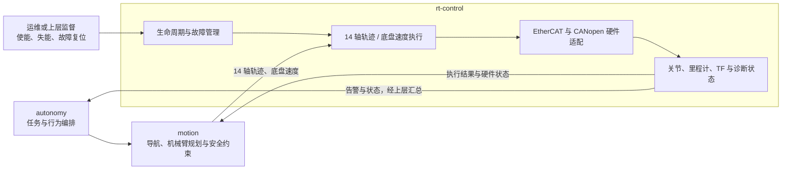
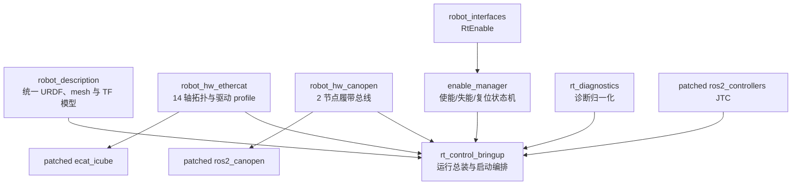
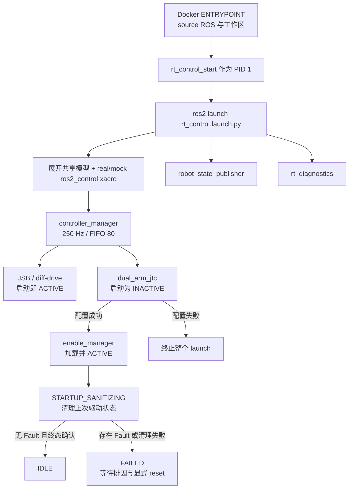
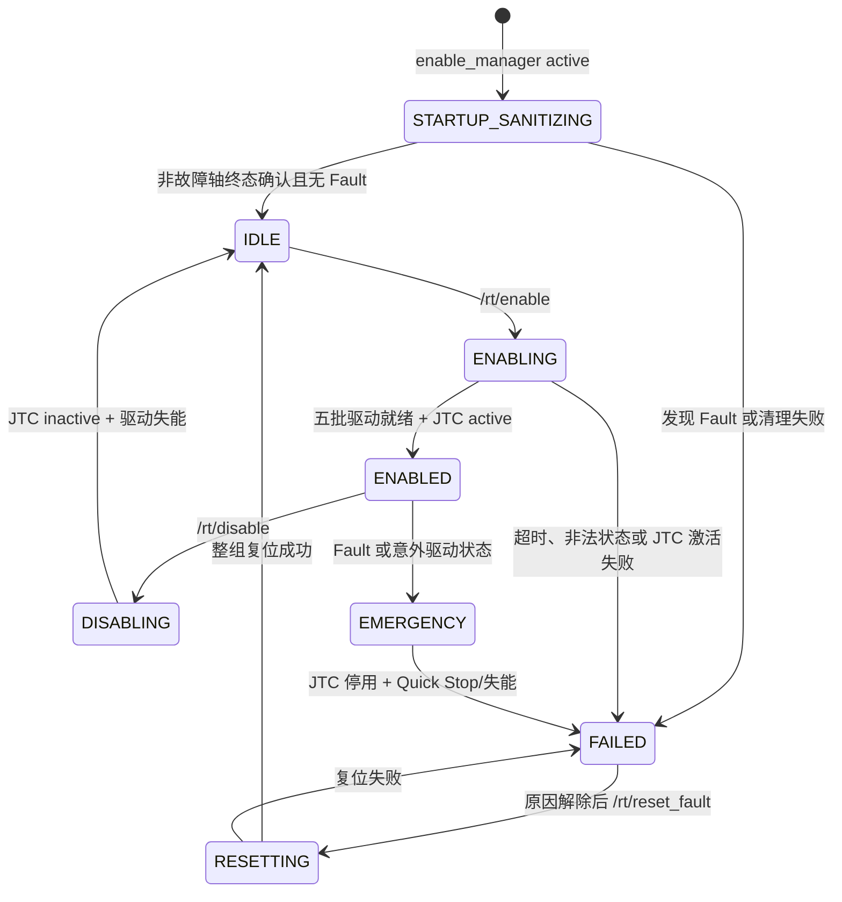

# rt-control 接手知识图谱

本文面向第一次接手 rt-control 的开发、联调和运维同事。目标不是逐文件复述代码，而是回答四个问题：rt-control 管什么、代码从哪里读、一次命令怎样走到硬件、修改一处会影响哪里。

本文是导航，不替代事实源。发生冲突时，应回到当前源码、[`BLOCKED-questions.md`](../BLOCKED-questions.md) 中已经裁决的事实，以及 [`PROGRESS.md`](../PROGRESS.md) 和实机验收记录。硬件参数、安全阈值和 CPU 配置不得凭本文推测。

## 先记住的六件事

1. rt-control 负责执行，不负责任务规划。正常业务命令方向是 `motion → rt-control`，工位、箱子、抓取策略和行为树不应进入本域。
2. 250 Hz 控制环完全留在 rt-control 容器内；上层通过轨迹、速度和生命周期接口交互。
3. `/rt/enable` 管理 14 个 EtherCAT 轴和 `dual_arm_jtc`；Updown 是第 14 轴并与 Turn 同属第五使能批次。两条履带仍属于 CANopen，硬件和底盘控制器在进程启动时激活，不受该服务门控。
4. 生产容器启动本身就会访问真实 EtherCAT，并激活 CANopen 硬件、初始化/设置模式/预置目标；CAN 驱动可能进入运行或激磁状态。它不能当作普通软件 smoke test，也不能只按“通信检查”授权。
5. 当前没有独立 `rt_watchdog`，也没有 motion/autonomy heartbeat 或“上层失联后全机自动停机”接口。FJT 与 `/cmd_vel` 各自遵循不同的取消/超时语义。
6. 当前已完成 14 轴逐轴最小低速 FJT，但多轴生产轨迹、履带方向/比例、故障注入和完整长稳测试仍不能写成“生产验收通过”。

## 1. 域边界图



rt-control 接收的是“已经规划并校验过的执行目标”，不应接收业务语义。对外真正需要理解的是下表，而不是底层 PDO、SDO 或 controller manager 服务。

| 方向 | 域间含义 | 当前 ROS 接口 | 关键约束 |
| --- | --- | --- | --- |
| motion → rt-control | 双臂、Turn 与 Updown 的完整轨迹 | `/dual_arm_jtc/follow_joint_trajectory` | 14 轴必须完整；JTC 只在 `/rt/enable` 成功后 active；旋转轴第一点误差不超过 1°，Updown 不超过 `0.05 m`，反馈年龄不超过 500 ms。 |
| motion → rt-control | 底盘线速度和角速度 | `/cmd_vel` | `Twist`；0.5 s 命令超时；控制器启动即 active，不受 `/rt/enable` 门控。 |
| 运维/监督 → rt-control | 14 个 EtherCAT 轴使能、失能、整组复位 | `/rt/enable`、`/rt/disable`、`/rt/reset_fault` | 三者请求为空，返回明确的成功、失败批次、关节、状态字和阶段；不是急停接口。 |
| rt-control → 上层 | 控制关节位置/速度、轨迹反馈与结果 | `/joint_states`、FJT feedback/result | `/joint_states` 当前约 50 Hz，导出 16 个 ros2_control 关节名；这不等于共享 URDF 有 16 个可动关节。 |
| rt-control → 导航/视觉 | 底盘里程计和本体 TF | `/diff_drive_controller/odom`、`/tf`、`/tf_static` | `odom → base_footprint` 约 50 Hz，RSP 提供 `base_footprint → base_link → 本体/传感器`；`map → odom` 不属于本域。 |
| rt-control → 运维/上层 | 统一硬件、使能和故障状态 | `/diagnostics` | 当前约 1 Hz，多发布者；消费者应按 `status.name` 聚合，不能假设一条消息包含完整状态树。 |

以下是内部实现接口，不应直接升级为跨域契约：`/dynamic_joint_states`、`/controller_manager/*`、原始 `digital_inputs/digital_outputs`、PDO、SDO 和裸 CAN 帧。当前也没有可供上层调用的真空/语义 IO 控制器或结果接口。已经删除的 `rt_watchdog` 和 `/heartbeat/motion`、`/heartbeat/autonomy` 也不是可用接口，不能假定系统存在全局上层失联保护。

## 2. 代码依赖知识图谱



依赖方向应保持为“共享模型/接口 → 功能包 → bringup”。功能包不得反向依赖 `rt_control_bringup`，共享包也不得依赖任何域实现。

| 节点 | 它回答的问题 | 第一个阅读入口 |
| --- | --- | --- |
| `robot_description` | 机器人有哪些 link/joint，TF 和几何从哪里来？ | [`robot.urdf.xacro`](../../../src/description/robot_description/urdf/robot.urdf.xacro) |
| `robot_interfaces` | 生命周期服务有哪些字段？ | [`RtEnable.srv`](../../../src/interfaces/robot_interfaces/srv/RtEnable.srv) |
| `robot_hw_ethercat` | 14 个轴怎样映射到 EtherCAT 从站、PDO 和状态接口？ | [`ecat.ros2_control.xacro`](../../../src/rt_control/robot_hw_ethercat/urdf/ecat.ros2_control.xacro)、[`config/slaves`](../../../src/rt_control/robot_hw_ethercat/config/slaves) |
| `robot_hw_canopen` | 左、右履带怎样映射到 CANopen Node 2/3？ | [`canopen.ros2_control.xacro`](../../../src/rt_control/robot_hw_canopen/urdf/canopen.ros2_control.xacro)、[`bus.yml`](../../../src/rt_control/robot_hw_canopen/config/bus.yml) |
| `enable_manager` | 14 轴为什么能安全分批上电、回滚和失能？ | [`enable_manager_controller.hpp`](../../../src/rt_control/enable_manager/include/enable_manager/enable_manager_controller.hpp)、[`enable_manager_controller.cpp`](../../../src/rt_control/enable_manager/src/enable_manager_controller.cpp) |
| `rt_diagnostics` | EtherCAT、CANopen 和使能状态怎样形成统一诊断？ | [`rt_diagnostics_node.cpp`](../../../src/rt_control/rt_diagnostics/src/rt_diagnostics_node.cpp) |
| `rt_control_bringup` | 哪些节点和控制器以什么顺序启动？ | [`rt_control.launch.py`](../../../src/rt_control/rt_control_bringup/launch/rt_control.launch.py)、[`controllers.yaml`](../../../src/rt_control/rt_control_bringup/config/controllers.yaml) |
| 上游窄补丁 | 为什么只看本仓库源码还解释不了生产行为？ | [`deps.repos`](../../../deps.repos)、[`patches`](../../../patches)、[`Dockerfile`](../../../docker/rt-control/Dockerfile) |
| 容器与宿主 | 镜像、CPU、DDS、设备和退出语义怎样落地？ | [`compose.yaml`](../../../docker/compose.yaml)、[`rt_control_start`](../../../src/rt_control/rt_control_bringup/scripts/rt_control_start)、[`hostsetup`](../../../hostsetup) |

三个上游补丁目录也是生产代码的一部分：

- `ecat_icube`：原始位置预装载、诊断状态接口、等待完整总线、有序回到 PREOP。
- `ros2_canopen`：节点运行模式、安全目标预置、激活失败回滚、履带 EMCY 整组停止和有序关停。
- `ros2_controllers`：FJT 第一轨迹点一致性与 EtherCAT 反馈新鲜度检查。

### 配置事实应该改在哪里

| 事实 | 当前权威入口 | 不应放在哪里 |
| --- | --- | --- |
| link/joint、TF、几何、惯量、机器人固有关节范围 | `robot_description/urdf/robot.urdf.xacro` | EtherCAT/CAN 配置、业务域的模型副本。 |
| EtherCAT 环位置、PDO/SDO、缩放与驱动 profile | `robot_hw_ethercat` 的 xacro 和 `config/slaves/*.yaml` | `robot_description`、motion 规划参数。 |
| CAN 节点、EDS、运行模式和总线参数 | `robot_hw_canopen/config/bus.yml`、权威 EDS 和 CAN xacro | controller 临时参数、手工生成物。 |
| controller 集合、频率、关节集合和运行时约束 | `rt_control_bringup/config/controllers.yaml` | 上层域的重复 controller 配置。 |
| 上游版本和行为改动 | `deps.repos`、`versions.env`、`patches/*` | 未锁定的现场源码副本。 |
| CPU、device、capability、DDS 与退出时间 | `docker/compose.yaml`、`docker/cyclonedds.xml`、启动脚本 | 镜像里的隐式默认值。 |
| 目标机 CPU/网卡/USB 设备事实 | `hostsetup` 和对应主机验收记录 | 从旧机器复制后未经验证的默认值。 |

`rt_control_bringup/config/joint_limits.yaml` 当前会被安装并参与迁移审计，但 launch 没有加载它；不能把它误当作已经生效的 controller 软件限位源。

## 3. 运行时四条主链

### 3.1 启动链



入口按以下顺序阅读：

1. [`docker/rt-control/entrypoint.sh`](../../../docker/rt-control/entrypoint.sh) 只负责 source 环境并执行命令。
2. [`rt_control_start`](../../../src/rt_control/rt_control_bringup/scripts/rt_control_start) 是唯一支持的生产 PID 1，并负责停机前失能。
3. [`rt_control.launch.py`](../../../src/rt_control/rt_control_bringup/launch/rt_control.launch.py) 负责模型、节点、控制器和启动顺序。
4. [`rt_control.urdf.xacro`](../../../src/rt_control/rt_control_bringup/urdf/rt_control.urdf.xacro) 决定装配真实硬件还是 mock hardware。
5. [`controllers.yaml`](../../../src/rt_control/rt_control_bringup/config/controllers.yaml) 决定控制器频率、关节集合和运行约束。

一个容易误解的事实是：`/rt/enable` 不是整个机器人的总授权开关。CANopen 履带硬件在 `Cia402System::on_activate()` 阶段就会 Boot、设置 PV 模式并预置零速度，diff-drive 控制器也在启动时直接 active；Updown 则受 14 轴 EtherCAT 生命周期联锁管理。

### 3.2 执行链

```text
14 轴：motion → FJT action → patched JTC → position command
       → EtherCATDriver / CiA402 drives → 250 Hz PDO

底盘：motion/Nav2 → /cmd_vel → diff_drive_controller → 两侧履带 velocity
       → Cia402System → CANopen node 2/3

```

14 轴固定顺序为右臂 6 轴、左臂 6 轴、`turn`、`updown`，不接受 partial goal。JTC 在接收 FJT 时同时检查完整集合、EtherCAT 反馈新鲜度和各轴第一点：13 个旋转轴阈值为精确 `0.017453292519943295 rad`，Updown 阈值为 `0.05 m`。

Updown 采用环位置 15 的 XMC SW 5.11 固定 PDO 和 4 ms CSP：`6553600 counts/m`，范围 `[0.0,0.8] m`，目标速度上限 `0.3 m/s`，加/减速度上限 `0.5 m/s²`。这些速度/加速度是 motion 时间参数化和实机验收约束；当前 JTC 不会从 `joint_limits.yaml` 自动执行它们。

### 3.3 使能与故障链



五个使能批次依次是：右 J1–J3、左 J1–J3、右 J4–J6、左 J4–J6、Turn + Updown。service 回调只提交请求，真正的状态机由 250 Hz `update()` 推进。建议按以下函数路径阅读：

1. `on_configure()`：建立三个 service、controller switch client 和诊断定时器。
2. `on_activate()`：清理旧状态并进入启动清理。
3. `update()`：实时状态机总入口。
4. `handleEnable()`、`handleDisable()`、`handleResetFault()`：非实时请求入口。
5. `updateEnable()`、`updateDownward()`、`updateReset()`、`startEmergency()`：各条状态路径。
6. `switchJtc()`：JTC active/inactive 的唯一正常联锁入口。

### 3.4 诊断与关停链

```text
EtherCAT read() → ros2_control 状态接口 → /dynamic_joint_states
                 → rt_diagnostics → master + 14 slave 诊断行

ros2_canopen 原生 /diagnostics → rt_diagnostics → node_2..3 归一化诊断
enable_manager → /diagnostics 中独立的使能状态行
```

`/diagnostics` 由多个发布者共同组成。至少应按名称观察 enable manager、EtherCAT master、14 个已配置 EtherCAT slave 和 2 个 CANopen node，不能依赖消息到达顺序。

正常关停链是：

```text
docker stop / SIGTERM
→ PID 1 捕获信号
→ rt_disable_once 调用 /rt/disable，最长等待 30 s
→ JTC 停用、14 轴有序失能
→ 向整个 ROS launch 进程组转发 SIGINT
→ CANopen 安全目标、NMT Stop 和 driver shutdown
→ EtherCAT master deactivate、等待从站 PREOP、release master
```

不得用 `docker kill`、`kill -9` 或直接启动 launch 绕过这条链。更完整的操作方法见 [新机部署与运行手册](deployment-operations-runbook.md)。

### 3.5 关键符号索引

| 符号 | 阅读它能回答什么 | 文件 |
| --- | --- | --- |
| `generate_launch_description()` | 全域如何总装、哪些 controller 以什么状态启动？ | [`rt_control.launch.py`](../../../src/rt_control/rt_control_bringup/launch/rt_control.launch.py) |
| `EnableManagerController::on_configure()` | service、controller switch client 和诊断怎样建立？ | [`enable_manager_controller.cpp`](../../../src/rt_control/enable_manager/src/enable_manager_controller.cpp) |
| `EnableManagerController::on_activate()` | 启动时怎样进入 `STARTUP_SANITIZING` 并清理旧状态？ | 同上 |
| `EnableManagerController::update()` | 非实时请求怎样由 250 Hz 状态机推进？ | 同上 |
| `handleEnable/Disable/ResetFault()` | 三个生命周期 service 怎样接收、拒绝或抢占请求？ | 同上 |
| `updateEnable()` | 五批 14 轴使能怎样逐步完成并激活 JTC？ | 同上 |
| `updateDownward()` / `startEmergency()` | 正常失能、使能回滚和运行中故障怎样收敛？ | 同上 |
| `updateReset()` | 整组 Fault Reset 怎样发上升沿并确认？ | 同上 |
| `validate_trajectory_start()` | 14 轴 FJT 如何按轴校验首点和 EtherCAT 反馈年龄？ | [`0001-jtc-start-consistency.patch`](../../../patches/ros2_controllers/0001-jtc-start-consistency.patch) |
| `RtDiagnosticsNode::publishSnapshot()` | 多路硬件状态如何变成 1 Hz 诊断树？ | [`rt_diagnostics_node.cpp`](../../../src/rt_control/rt_diagnostics/src/rt_diagnostics_node.cpp) |
| `rt_disable_once` 的 `main()` | PID 1 在退出前如何等待 `/rt/disable` 最终结果？ | [`rt_disable_once.cpp`](../../../src/rt_control/enable_manager/src/rt_disable_once.cpp) |

## 4. 按任务找代码

| 要做的事 | 先看哪里 | 直接影响 | 需要联查 |
| --- | --- | --- | --- |
| 修改 link/joint、TF、几何或关节固有属性 | `robot_description` | 所有模型消费者 | motion、perception、rt-control 的联合模型验证。 |
| 修改 14 轴映射/PDO/驱动参数 | `robot_hw_ethercat` | EtherCAT 插件、enable manager、diagnostics | 冻结 profile、上游补丁、迁移差异和实机分级验收。 |
| 修改使能、失能、Fault Reset | `enable_manager` | 14 轴、JTC 生命周期、停机路径 | `rt_disable_once`、诊断、mock 与实机故障路径。 |
| 修改 14 轴轨迹准入 | `controllers.yaml` + JTC patch | motion 的 FJT 调用 | 完整性、逐轴首点误差、反馈新鲜度、取消与结果语义。 |
| 修改 Updown | `xmc_updown_sw511.yaml` + EtherCAT xacro + JTC/limits | motion 和 EtherCAT slave 15 | 固定 PDO、SI/counts 换算、CSP 周期、第五批使能和整组故障语义。 |
| 修改底盘 | `controllers.yaml` + `bus.yml` + ros2_canopen patch | `/cmd_vel`、odom、CAN node 2/3 | Nav2 参数、方向/比例、EMCY 与停止距离。 |
| 修改诊断 | `rt_diagnostics` + 两类硬件状态接口 | 运维、autonomy/gateway 的状态汇总 | 多发布者聚合、陈旧判据、恢复后历史证据。 |
| 增加真空或语义 IO | 先定义跨域契约，再实现 controller/hardware adapter | motion 与机械执行 | 当前只有部分底层 digital interface，不等于已有公共功能。 |
| 修改部署 | Dockerfile、Compose、启动脚本、`hostsetup` | 宿主、总线和所有运行包 | CPU/设备身份、权限、优雅退出、镜像与源码 SHA。 |

## 5. 推荐阅读顺序

### 30 分钟建立全貌

1. 读根 [`README.md`](../../../README.md)、根 [`AGENTS.md`](../../../AGENTS.md) 和本域 [`AGENTS.md`](../AGENTS.md)，先确定边界和安全规则。
2. 读本页前四节，建立接口、包依赖、启动和关停模型。
3. 读 `rt_control.launch.py`、`controllers.yaml` 和三个 ros2_control xacro，理解总装。
4. 读 `RtEnable.srv`，然后浏览 enable manager、XMC SW 5.11 profile 和 diagnostics。
5. 最后看 [`PROGRESS.md`](../PROGRESS.md) 的验证边界，并在 [`BLOCKED-questions.md`](../BLOCKED-questions.md) 按设备、接口或 BQ 编号搜索。该文件后面的裁决可能取代早期记录，不建议只读前几项。

### 半天进入可修改状态

1. 沿 `launch → controller config → xacro → plugin` 跟一遍启动链。
2. 沿 `service callback → atomic request → update FSM → hardware command interface` 跟一遍使能链。
3. 阅读 `deps.repos` 和三个补丁目录，理解本仓库对上游行为的改变。
4. 阅读 `Dockerfile`、Compose、`rt_control_start` 和 `rt_disable_once`，理解进程和退出语义。
5. 针对自己的改动，查相应 commissioning 记录和未闭环项，再决定只做静态、mock 还是申请实机验证。

## 6. 当前代码与约定的已知差距

这些项目应在交接和评审中显式说明，不能用文档措辞掩盖：

| 等级 | 差距 | 对接手人的影响 |
| --- | --- | --- |
| 高 | XMC SW 5.11 的实机固定 PDO 与供应商 XML 不一致；当前 profile 以 slave 15 的 SII/PDO 扫描为权威，尚未完成 OP、使能和低速运动验收。 | 固件升级或换驱动器必须重读 SII 并逐项比对；不得直接用旧 XML 覆盖 profile，也不得把 mock/构建成功当实机通过。 |
| 高 | BQ-115 是明确的硬件安全例外：`right_joint2/right_joint3/left_joint2/left_joint3` 四个 Ti5 在控制字 `0x0000` 下只到 Ready To Switch On；master release 后会以 `0x7500` 进入 Fault。 | 该状态只因设备手册和实测被接受为“未激磁”终态，不是 literal Switch On Disabled；最终验收要人工签字，下一次启动通常要显式 `/rt/reset_fault`。 |
| 高 | BQ-117 仍开放：Ti5 `0x10F1:02` 的 ESI 声明宽度与实机上传长度不一致。 | 换驱动、固件或新机器时不能假定当前容忍策略仍成立。 |
| 高 | Compose 设置了 `CYCLONEDDS_URI` 并挂载 loopback-only XML，但没有设置 `RMW_IMPLEMENTATION`；当前已检查镜像实际报告 `rmw_fastrtps_cpp`。 | 该 XML 目前不能作为网络隔离保证；host network 下 ROS/DDS 可能使用非 loopback 网卡。启动后要核对实际 RMW 和网络暴露，修复前不得宣称“远程发现被关闭”。 |
| 中 | `joint_limits.yaml` 会被安装，但当前 launch/runtime 没有加载它。 | 它目前是迁移/审计数据，不能声称 JTC 或硬件已从该文件自动执行软件限位。 |
| 中 | `rt_disable_once` 失败会打印 `UNCLEAN_SHUTDOWN`，但 PID 1 最终退出码仍取 ROS launch 子进程。 | 容器可能 exit 0 但失能不干净；停机验收必须同时检查日志和总线终态。 |
| 中 | 底层有部分 digital IO 状态/命令接口，但没有真空/语义 IO controller 和域间消息。 | 不能把裸 IO 当作已经可用的吸附控制能力。 |
| 中 | `/joint_states` 有 16 个控制关节名，但共享 URDF 只有 12 臂轴、`turn`、`updown` 共 14 个 movable joint；两条 track joint 不在模型中，`pitch` 当前按阶段性裁决固定为零。 | 不能从 state 数量推导 TF/模型覆盖；未来接入真实 pitch 反馈或 track 模型时属于跨域模型/接口变更。 |
| 中 | `robot-001` 当前写在运行配置/代码中，仓库还没有按机器人 serial 管理配置的发布机制。 | 多机器人部署前需要配置归属和版本化方案。 |
| 中 | Compose wrapper 没有固定 project name，默认会从发布目录名推导。 | 从不同末级目录直接回退可能创建第二套同为 host network、访问同一硬件的容器；发布目录约定和“全机唯一 rt-control project”必须显式核对。 |
| 中 | 仓库还没有正式 release manifest、healthcheck、镜像传输、全离线宿主 bootstrap 和自动 rollback 工具。 | 新机部署必须人工保存 SHA、image ID、宿主依赖/事实和验收证据；传一个 Docker image 不等于离线新机已可部署。 |

当前验证边界以 [`PROGRESS.md`](../PROGRESS.md)、[`host-setup-record.md`](host-setup-record.md) 和 [`ethercat_enable_disable_commissioning.md`](ethercat_enable_disable_commissioning.md) 为准。构建成功、mock 成功或一次通信上线，都不能替代实机运动、故障和长稳验收。
